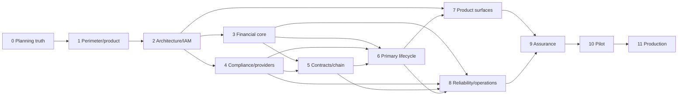

# Production Dependency Graph

## Parallelism policy

- Phase 3 and Phase 4 may use separate planning/research packets after Phase 2 passes; integration remains controller-sequenced.
- Phase 7 UX research may proceed before Phase 6, but production implementation cannot bind to unfrozen APIs or states.
- Phase 8 infrastructure design may begin early, but G8/G9 cannot pass before Phases 3-6.
- No other dependency may be waived by an agent.

## Machine-readable source

`.planning/ROADMAP.md` uses the exact `**Depends on:**` field parsed by GSD. The controller reruns `roadmap analyze` after each phase and blocks any phase whose dependencies have not passed.
