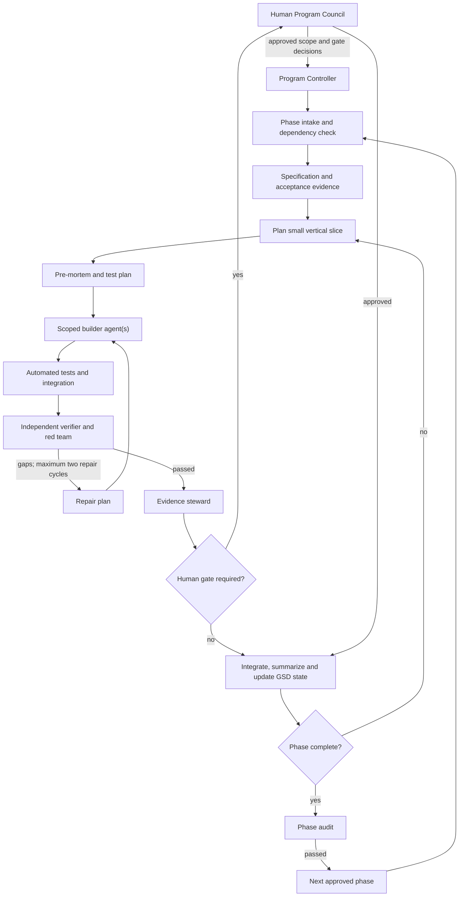

# BlockXOne Controlled Autonomous Delivery Loop

**Version:** 1.0 draft for approval
**Date:** 2026-07-19
**Purpose:** turn the BlockXOne production master plan into verified software and operating evidence without allowing agents to self-approve regulated, financial or irreversible decisions

## 1. Recommendation

Use one persistent **Program Controller** with a maximum of three specialist agents active beside it. Run one approved GSD phase at a time, decompose that phase into small vertical slices, and require both an independent verifier and a domain-focused adversarial reviewer before integration.

The loop is:

> decide -> specify -> plan -> pre-mortem -> build -> test -> adversarial review -> repair -> evidence -> human gate -> integrate -> update state -> repeat

This is preferable to an always-on swarm. A broad swarm would create conflicting implementations across identity, ledger, contracts, providers and UI before their shared invariants are settled.

## 2. Preconditions before autonomy

The execution loop must not begin modifying production-target code until these are complete:

1. Preserve or reconcile the current dirty `main` worktree. Existing modifications and deletions are user-owned and must not be discarded.
2. Establish a reviewed baseline commit and an isolated `codex/` delivery branch or worktree.
3. Reconcile GSD metadata:
   - `gsd-tools init milestone-op` currently identifies `v1.0` and milestone name `milestone`;
   - `.planning/STATE.md` identifies `v2.0` and milestone name `rebuild`.
4. Reconcile roadmap/requirements status:
   - Phase 2 is marked complete;
   - `WEB-01` and `WEB-02` remain pending in `.planning/REQUIREMENTS.md`.
   - roadmap analysis reports `current_phase: 7`, `next_phase: 3` and `67%` progress even though only 2 of 10 phases are complete;
   - every parsed dependency is currently `null`, so prose dependencies are not machine-enforced;
   - Phase 7 and 8 plans were prepared before their API, state-machine and authorization foundations and should be regenerated when those dependencies freeze.
5. Map the production master plan's legal, ledger, reconciliation, custody, provider, operational, commercial and evidence requirements into `.planning/REQUIREMENTS.md` and phase success criteria.
6. Approve or change the ten launch decisions in Section 29 of `docs/BLOCKXONE_PRODUCTION_MASTER_PLAN.md`.
7. Insert a pre-implementation phase before Phase 3 for operating perimeter, source-of-truth decisions, control architecture and clean-baseline evidence.
8. Define the commands that constitute the authoritative test suite for every application, contract, migration and environment.
9. Put `.planning` decision and evidence artifacts under an approved version-history policy; they are currently local-only and not reliable release evidence by themselves.

GSD health currently reports `healthy`, but it does not detect the manual milestone-version and Phase 2 traceability mismatches above. Those must be resolved deliberately.

## 3. Control-loop architecture



## 4. Agent-slot allocation

The current environment supports four concurrent agents including the root controller. Use the slots dynamically.

| Slot | Default role | Authority |
| --- | --- | --- |
| 1 | Program Controller and integrator | Owns scope, file allocation, dependency order, state, final integration and escalation; does not waive a gate |
| 2 | Primary builder | Implements one bounded plan with explicit file ownership |
| 3 | Independent verifier | Derives tests from the acceptance criteria and checks the exact change without authoring it |
| 4 | Domain adversarial reviewer | Rotates across finance/compliance, blockchain/security, IAM/tenancy, UI/UX and SRE; actively tries to violate the slice's invariants |

For low-risk work, the verifier or adversarial slot may temporarily become a second builder only when the two builders own disjoint directories or modules. Independent verification must then run after a builder slot is released. No two agents may make overlapping edits concurrently.

## 5. Persistent controller responsibilities

The Program Controller must:

- read `PROJECT.md`, `REQUIREMENTS.md`, `ROADMAP.md`, `STATE.md`, the current phase context and the production master plan before selecting work;
- select the smallest unfinished, dependency-ready vertical slice;
- record assumptions and block on decisions that alter the legal/product perimeter;
- allocate exact files or modules to each editing agent;
- keep a single authoritative task and evidence ledger;
- prevent agents from changing unrelated user work;
- integrate one reviewed change at a time;
- update GSD state only after verification evidence exists;
- stop on regulated gates, destructive operations, external credentials, real money, mainnet or residual-risk acceptance;
- re-read the roadmap and blocker register after every completed slice;
- produce a concise progress, risks, evidence and next-action report.

## 6. Per-slice execution contract

Every slice must have this contract before implementation:

| Field | Required content |
| --- | --- |
| Objective | One observable business or control outcome |
| Scope | Exact modules, routes, schema, contracts and UI surfaces allowed to change |
| Exclusions | Explicitly deferred behavior |
| Dependencies | Prior decisions, providers, schemas, contracts and phase artifacts |
| Invariants | Security, financial, compliance, tenancy and lifecycle truths that must never break |
| Acceptance tests | Normal, negative, concurrent, retry, recovery and accessibility cases |
| Evidence | Files, commands, reports, screenshots/logs and reconciliations required |
| Rollback | How the change can be disabled or reversed safely |
| Owner | Builder, verifier and human gate owner |

No objective may be phrased only as “build the page,” “add the endpoint” or “deploy the contract.” It must state the authoritative state transition and proof of correctness.

Recommended machine-readable packet header:

```yaml
id: BXO-PH03-WP001
phase: 3
gate: G2
risk_class: high
scope: []
out_of_scope: []
requirements: []
dependencies: []
human_prerequisites: []
invariants: []
acceptance_criteria: []
adversarial_scenarios: []
required_evidence: []
rollback: []
required_reviewers: []
required_human_signatories: []
attempt: 0
max_autonomous_rework: 2
```

## 7. The inner build loop

### Step 1 — Intake

- Confirm phase dependency and master-plan gate alignment.
- Confirm the worktree is clean for the files in scope.
- Confirm no unresolved decision changes the implementation.
- Load existing conventions and prior phase decisions.

### Step 2 — Specification

- Create or update phase `CONTEXT.md`.
- For frontend work, create the `UI-SPEC.md` before coding.
- Define state machine, authorization matrix, posting rules, contract invariants or UX state vocabulary as relevant.
- Define the evidence that will prove completion.

### Step 3 — Plan and pre-mortem

- Decompose into plans that can be verified independently.
- Have the verifier identify likely failure paths before implementation.
- Add negative, concurrency, retry, timeout, partial-failure and recovery cases to the plan.
- Reject plans that combine unrelated financial, contract and UI changes.

### Step 4 — Build

- Builder changes only allocated files.
- Database, API, workflow, contract and UI layers use the same canonical states and identifiers.
- Tests are added with implementation, not afterward.
- Mocks and dev modes are compile-time or deployment-time excluded from production.
- No agent introduces credentials, production transactions, mainnet deployments or provider writes without explicit authority.

### Step 5 — Automated verification

Run the applicable checks from a clean environment:

- format, lint, type and build;
- unit, database, migration and property tests;
- API integration and real-router tests;
- workflow crash/retry/idempotency tests;
- frontend component, accessibility and E2E tests;
- smart-contract unit, invariant, fuzz, conformance and deployment tests;
- signer, nonce, receipt, finality, replacement and reorganisation tests;
- balanced-journal, reservation, reconciliation and period-close tests;
- dependency, secrets, SAST, container, IaC and configuration scans;
- backup/restore, provider-degradation and operational drills when in scope.

### Step 6 — Independent adversarial review

The verifier must review the actual diff and run evidence, then try to disprove:

- tenant and resource isolation;
- authentication freshness, replay resistance and revocation;
- idempotency and exactly-once financial effect;
- balanced and reconstructible accounting;
- eligibility and transfer restrictions;
- provider authentication and unknown-outcome handling;
- contract role, claim, initialization and upgrade invariants;
- chain receipt, finality, replacement and reorganisation behavior;
- UI status truth and failure recovery;
- audit completeness and observability.

The verifier returns `passed`, `gaps_found`, `human_needed` or `blocked`, with evidence paths and reproduction commands. The adversarial reviewer separately returns findings classified by severity and invariant. Missing evidence is failure, never a conditional pass.

### Step 7 — Repair

- Convert every gap into a bounded repair plan.
- Allow at most two autonomous repair cycles for the same underlying failure.
- If the same blocker persists, stop and escalate with evidence and options.
- Critical/high, financial-integrity, tenant-isolation, contract-safety and false-success gaps cannot be deferred.

### Step 8 — Evidence and integration

- Store the verification report, security/finance/blockchain review as applicable, evidence index and summary in the phase directory.
- Tie evidence to the exact commit SHA, artifact digest, schema version, environment and contract bytecode where applicable.
- Confirm tests map to requirements and production-master-plan gates.
- Integrate only after the independent verifier passes and any human gate approves.
- Update `STATE.md`, `ROADMAP.md` and the decision/risk registers.
- Preserve the evidence; do not auto-clean completed phase artifacts.

## 8. Phase-specific agent roster

| Phase | Builder/domain agents | Independent emphasis | Required human gate |
| --- | --- | --- | --- |
| Pre-Phase 3 control baseline | Product/control architect, planning integrator | Traceability and source-of-truth review | Program Council, Legal, MLRO, CFO/Controller, CTO/CISO |
| 3 Identity, organisations and access | IAM/backend builder, security/tenancy specialist, UI auth specialist | Cross-tenant, replay, revocation, MFA, machine identity | CISO, MLRO and enterprise identity owner |
| 4 Core domain and data | Domain/database builder, finance-ledger specialist | Posting, reservations, concurrency, audit and RLS | Controller/CFO and product approval |
| 5 Contracts and token layer | Solidity builder, blockchain operations specialist | ERC-3643 conformance, roles, claims, deployment and invariants | Legal/registrar, CISO, custody and external auditor |
| 6 Workflow and providers | Workflow/backend builder, payments/KYC/compliance specialist | Webhooks, idempotency, unknown outcomes and reconciliation | MLRO, Treasury, Controller and provider owners |
| 7 Investor portal | Frontend builder, investor UX/accessibility specialist | Status truth, disclosures, mobile, failure recovery | Product, Legal/Compliance and accessibility owner |
| 8 Operator console | Frontend/API builder, operations/SoD specialist | Permissions, maker-checker, evidence and dangerous actions | COO, MLRO, Controller and CISO |
| 9 Indexing/reporting/asset ops | Indexer/data builder, finance/chain reconciliation specialist | Reorg/replay, supply/register/ledger and statement accuracy | Controller, registrar and operations |
| 10 Security/release/migration | Platform/SRE builder, security/migration specialist | Clean deployment, DR, cutover, penetration and exact artifacts | Executive Risk, CISO, Legal, MLRO, Controller and Operations |

## 9. Reusable skill gates

Apply the local readiness skills as repeatable evidence checks:

- `blockxone-financial-readiness` during Phases 4, 6, 9 and 10 and on every financial lifecycle pull request;
- `blockxone-blockchain-readiness` during Phases 5, 6, 9 and 10 and before every deployment candidate;
- UI/UX review for every frontend phase and high-risk journey;
- Sales/business-case controls for public claims, pilot scope, pricing and customer evidence;
- security scanning and independent assurance continuously, not only in Phase 10.

Scanner findings are triage signals. Each must be marked `Validated`, `Resolved` or `False positive` with evidence.

## 10. Human-only gates

Agents may prepare options and evidence but may not approve:

- jurisdiction, licensing, regulated activity or legal enforceability;
- instrument terms, legal register of record or investor eligibility policy;
- accounting policy, tax treatment, materiality or period-close acceptance;
- AML/CTF policy, sanctions disposition or suspicious-activity decisions;
- custody/provider selection, liability allocation or provider certification;
- production keys, key ceremony, signer quorum or privileged role holders;
- mainnet deployment, real-money enablement, data migration or irreversible cutover;
- external audit residual-risk acceptance;
- production pricing or unsupported commercial claims;
- pilot expansion beyond approved value, customer, asset, currency, jurisdiction or chain limits.

## 11. Fail-closed continuation rules

The controller continues automatically only when:

- dependencies are complete;
- all required automated checks pass;
- the independent verifier returns `passed`;
- no material reconciliation or audit break is open;
- no unresolved critical/high or control-integrity finding exists;
- no human-only decision is pending;
- the change stays inside the approved launch perimeter.

The controller stops when:

- the same blocker survives two repair cycles;
- a test or evidence source cannot be reproduced;
- files outside assigned scope would need destructive or conflicting changes;
- a provider, credential, external environment or qualified opinion is required;
- a proposal changes the legal/product perimeter;
- the dirty worktree makes ownership ambiguous;
- production, mainnet, real money, personal data or irreversible migration is involved.

Production-critical gaps cannot use a “continue anyway” option.

## 12. Branching and integration policy

1. Preserve the current `main` state before autonomous edits.
2. Create a clean `codex/blockxone-production-v1` integration branch or dedicated GSD workspace from the approved baseline.
3. Use one short-lived branch/worktree per active phase plan when changes are large or concurrent.
4. Allocate files before agents edit; overlapping ownership is prohibited.
5. Builders make small intentional commits with tests.
6. The verifier reviews commit range and clean-environment results.
7. The controller integrates sequentially and reruns the aggregate gate.
8. Never auto-push, open a PR, deploy or clean artifacts without explicit authority.

## 13. State and evidence artifacts

Each phase should contain, as applicable:

- `CONTEXT.md` — accepted decisions and boundaries;
- `UI-SPEC.md` — frontend design contract;
- `PLAN.md` files — executable slices;
- `VALIDATION.md` — test architecture and commands;
- `VERIFICATION.md` — independent result and evidence;
- `SECURITY-REVIEW.md` — threats and findings;
- `FINANCIAL-CONTROL-REVIEW.md` — ledger/reconciliation evidence;
- `BLOCKCHAIN-REVIEW.md` — contract/chain evidence;
- `EVIDENCE.md` — requirement-to-artifact index;
- `SUMMARY.md` — delivered behavior, migrations, operations and remaining risk.

The controller also maintains:

- `.planning/STATE.md`;
- `.planning/ROADMAP.md`;
- requirements traceability;
- decision, risk and blocker registers;
- the production evidence/sign-off register from the master plan.

## 14. Progress and control metrics

Track outcomes rather than agent activity:

- phase gates passed versus total;
- requirements with reproducible evidence;
- first-pass verification rate;
- reopened defect rate;
- critical/high findings and age;
- test flake rate;
- unresolved decision/blocker age;
- financial reconciliation breaks and age;
- cross-tenant negative-suite pass rate;
- critical-journey E2E pass rate;
- accessibility blockers;
- deployment/restore/drill success;
- scope changes and accepted residual risks.

Agent tokens, messages or lines of code are not completion metrics.

## 15. Recommended execution cadence

### Per slice

- one controller-owned objective;
- one or two scoped builders;
- one independent verifier;
- maximum two repair cycles;
- evidence and state update before selecting the next slice.

### Per phase

1. Phase discussion/decision checkpoint.
2. UI design contract where applicable.
3. Plan and validation architecture.
4. Wave-based execution.
5. Independent phase verification.
6. Domain review using finance/blockchain/security/UI gates.
7. Human validation or sign-off where required.
8. Phase summary and state transition.

### Per milestone

- cross-phase UAT and reconciliation audit;
- production master-plan gate audit;
- external assurance and operational drills;
- pilot exit evidence;
- named go/no-go decision;
- archive only after explicit approval.

## 16. Recommended GSD rebaseline

The current 10-phase roadmap is a valuable product outline but is not yet a safe autonomous execution graph. Rebaseline the active production milestone as:

| Phase | Outcome |
| --- | --- |
| 0 | Planning truth, dirty-worktree containment, approved baseline and evidence policy |
| 1 | Legal perimeter, golden instrument, source-of-truth model and commercial validation |
| 2 | Architecture, IAM, organisations, tenancy and segregation of duties — G2 |
| 3 | Typed instrument domain, double-entry ledger, reservations and reconciliation — G3 |
| 4 | AML/KYC/KYB, documents, privacy and certified provider boundaries — G4 |
| 5 | Contracts, signer, governance, indexer, finality and reorganisation handling — G5 |
| 6 | Golden subscription, issuance, servicing, payout and redemption lifecycle |
| 7 | Public, investor and operator product surfaces — G6/G7 |
| 8 | Reporting, reliability, DR and complete operating model — G8/G9 |
| 9 | Integrated independent assurance and exact-release evidence |
| 10 | Bounded paid production pilot and 30-day stability proof |
| 11 | Production decision, limited launch and hypercare |

Multi-asset expansion, secondary trading, additional jurisdictions, chains or investor categories become separate later milestones.

Keep `workflow.auto_advance: false`. Use GSD context, planning, UI-specification, execution and verification primitives inside this hardened controller. Do not invoke stock `$gsd-autonomous` across the milestone until it is wrapped to remove phase skipping, gap acceptance, validation deferral and automatic cleanup for mandatory production controls.

## 17. Bootstrap sequence

Execute these steps before autonomous implementation:

1. Inventory and attribute the current dirty changes without deleting or resetting anything.
2. Decide what belongs in the approved rebuild baseline.
3. Create the isolated integration branch/workspace.
4. Correct the milestone metadata and Phase 2 requirements traceability.
5. Add master-plan requirements and gate ownership to GSD.
6. Insert and complete the control-baseline phase.
7. Approve the launch-perimeter decisions.
8. Create Phase 0 context, validation architecture, control map and plan.
9. Run one Phase 0 containment/rebaseline slice through the full loop as a calibration exercise.
10. Review its quality, cost and evidence before enabling phase-to-phase auto-advance.

## 18. Completion condition

The loop is complete only when:

- all approved GSD phases pass independent verification;
- every production-master-plan gate has reproducible evidence;
- the bounded pilot meets its stability, reconciliation and drill criteria;
- external legal, accounting, security and contract evidence is complete;
- no prohibited production blocker remains;
- named domain owners approve the final evidence register;
- the Program Council issues an explicit production go decision.

Code completion, passing unit tests or a successful deployment alone does not complete the loop.
