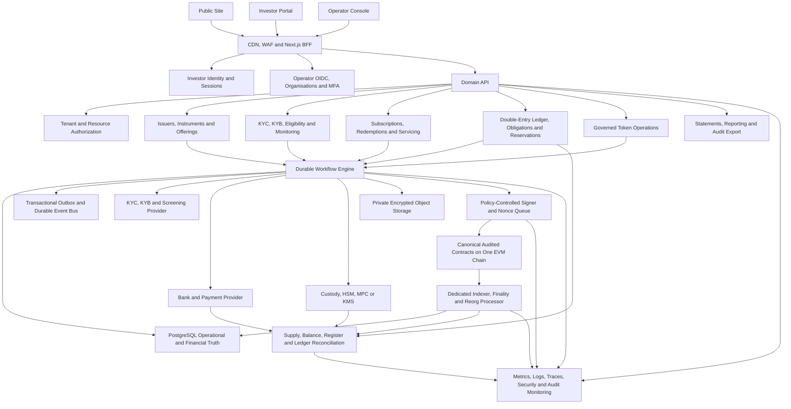
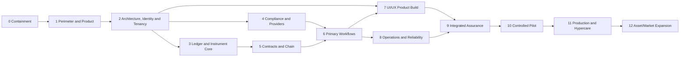

# BlockXOne Production, Product, UI/UX and Commercial Master Plan

**Version:** 1.0 draft for approval
**Date:** 2026-07-19
**Program posture:** controlled rebuild with evidence-gated release
**Production verdict at plan start:** no-go for real money, real identity documents, legally effective issuance, custody, payouts or secondary trading

## 1. Executive decision

BlockXOne should be rebuilt as a regulated multi-asset tokenization operating system, not hardened incrementally as if the current sprint implementation were already the target product.

The architecture should support multiple instrument types, but the first production launch should deliberately support only:

- one jurisdiction;
- one issuer or issuing SPV;
- one legally approved instrument type;
- professional or otherwise eligible investors;
- one settlement currency;
- one EVM network;
- one approved KYC/KYB provider;
- one approved custody/signing model;
- one approved bank/payment route;
- primary subscription, reconciled issuance, servicing, reporting and controlled redemption.

Secondary trading, automated matching, public on/off-ramp, retail participation, cross-border flows, FX, multi-chain deployment and unsupported asset classes remain disabled until separately licensed, designed, tested and approved.

With a dedicated multidisciplinary team, providers, counsel and independent auditors, a defensible first real-money launch is an indicative **9-12 month program**. A materially smaller team should plan for **12-18 months**. These are planning ranges, not commitments; the gates control release, not the date.

## 2. Authority and relationship to existing plans

This plan:

- preserves the existing decision in `.planning/PROJECT.md` to use the current repository as reference rather than as the product definition;
- expands `.planning/ROADMAP.md` into a production operating plan with financial, legal, security, UX, commercial and evidence gates;
- supersedes production-readiness claims in earlier narrative reports when those claims conflict with executable code or verified evidence;
- does not automatically rewrite existing GSD phase files; approved portions can be mapped into them deliberately;
- uses source-backed audit findings from the current workspace and labels unconfirmed launch assumptions explicitly.

## 3. Planning assumptions and decisions

| Decision | Recommended default | Status | Decision owner | Must be resolved by |
| --- | --- | --- | --- | --- |
| First jurisdiction | South Africa | Assumption | Board, General Counsel, MLRO | Phase 1 gate |
| First instrument | Closed-ended private-market fund interest or private debt note; choose the cleaner perimeter after counsel review | Decision required | Product Approval Committee | Phase 1 gate |
| Investor segment | Professional/institutional/eligible investors only | Assumption | Legal, Compliance, Commercial | Phase 1 gate |
| Settlement currency | ZAR only | Assumption | CFO/Treasury | Phase 1 gate |
| Chain | One EVM network | Confirm network later | CTO, Blockchain Lead, Risk | Phase 2 gate |
| Custody | Regulated custody or tightly governed hybrid model | Decision required | Legal, CISO, Custody Lead | Phase 2 gate |
| Operator identity | Enterprise OIDC with organisation-scoped roles | Recommended | CTO/CISO | Phase 2 gate |
| Investor identity | Email/passkey first; wallet linking second; step-up MFA for risk actions | Recommended | Product/CISO/MLRO | Phase 2 gate |
| Core backend | Dedicated domain services plus durable workflow engine; Next.js remains UI/BFF only | Recommended | Architecture Council | Phase 2 gate |
| Ledger | Immutable double-entry subledger with reservations, obligations and reconciliation | Mandatory | CFO/Controller/CTO | Phase 2 gate |
| Token standard | Officially conformant ERC-3643 implementation or explicitly named alternative | Decision required | Legal, Transfer Agent, Blockchain Lead | Phase 3 gate |
| Secondary market | Excluded from first launch | Recommended | Board, Legal, Commercial | Reconsider after stable primary operations |

If a recommended default is rejected, the program must document the alternative, consequences, new dependencies and changed acceptance gates.

## 4. Non-negotiable operating principles

1. **Multi-asset architecture, narrow launch perimeter.** Every new instrument class is a new product approval, not a metadata switch.
2. **No false success.** UI, API, ledger and reporting use authoritative workflow states and never claim completion from a browser action, API acceptance or transaction broadcast.
3. **Financial truth is reconciled.** Legal register, bank, custodian, token subledger, accounting ledger and finalized chain state remain distinct and reconciled.
4. **Identity is not a wallet.** Wallet ownership is one factor; KYC/KYB, authority, organisation, eligibility and risk remain first-class.
5. **Controls are enforceable.** Critical rules live in database constraints, transaction boundaries, state machines, policy engines, signer policies and contract invariants—not in copy or operator memory.
6. **Every retry is safe.** Stable idempotency keys, uniqueness constraints, reservations and atomic state claims prevent duplicate financial effect.
7. **Maker-checker by design.** Issuance, payouts, NAV publication, recovery, force transfer, compliance override, role administration and upgrades require appropriate dual control.
8. **Evidence, not ambition.** A feature is done only when code, tests, policy, runbook, telemetry, training and sign-off evidence exist.
9. **Security and accessibility are release gates.** They are not post-launch enhancement work.
10. **Sales claims follow delivered controls.** Marketing must never imply licensing, custody, compliance, settlement finality, asset coverage or audit status that has not been verified.

## 5. Recommended product surfaces

BlockXOne remains three related products with separate responsibilities and identity boundaries.

### 5.1 Public trust and education site

Purpose:

- explain tokenization without crypto jargon;
- establish the exact operating perimeter and trust model;
- describe supported and planned asset classes honestly;
- qualify prospective issuers/operators;
- route investors and operators to separate authentication surfaces;
- host legal, privacy, security, accessibility and complaint information.

### 5.2 Investor portal

Purpose:

- identity, qualification and wallet linking;
- opportunity discovery and authoritative instrument detail;
- document review and versioned acceptance;
- subscription, allocation, payment and settlement tracking;
- holdings, valuations, distributions, statements and tax documents;
- controlled redemption and support.

### 5.3 Operator console

Purpose:

- issuer, instrument and offering setup;
- compliance case management and monitoring;
- subscription, allocation and settlement operations;
- treasury, reconciliation and break management;
- transfer-agent and token operations;
- servicing, distributions, redemptions and reporting;
- audit, access administration, provider operations and platform controls.

## 6. Target operating architecture

### 6.1 Source-of-truth model

| Domain | Authoritative source | Platform projection | Required reconciliation |
| --- | --- | --- | --- |
| Legal ownership | Applicable legal register, trustee, registrar or issuer record | Investor ownership view | Register to token ledger and finalized chain |
| Token supply and balance | Finalized contract state through independently controlled indexer | Holdings/token subledger | Chain to ledger, legal register and accounting |
| Client cash | Bank or safeguarded-money account | Cash subledger | Bank/provider to cash ledger and obligations |
| Custodied assets | Custodian or asset-specific registry | Asset/custody register | Custodian to platform and legal record |
| Financial position | Double-entry subledger reconciled to general ledger | Dashboards and statements | Subledger to GL, cash, custody and chain |
| KYC/eligibility | Approved case with provider evidence and policy decision | Eligibility projection | Provider events, case evidence and policy version |
| Workflow state | Durable workflow state plus accepted source events | UI timelines and queues | Workflow to provider, chain and ledger evidence |
| Audit evidence | Transaction-coupled append-only audit and WORM export | Search/reporting view | Completeness and tamper-evidence checks |

### 6.2 Recommended service boundaries

- Identity and session service.
- Organisation, membership and resource-authorization service.
- Issuer, legal-entity, instrument and offering service.
- Compliance and eligibility service.
- Document, disclosure, consent and e-sign evidence service.
- Subscription, allocation and redemption service.
- Financial ledger and posting service.
- Treasury, payment, payout and reconciliation service.
- Custody, wallet and beneficiary service.
- Token-operation command service.
- Signer and durable nonce service.
- Chain indexer, finality and reorg service.
- Servicing and corporate-action service.
- Reporting, statements and regulatory export service.
- Audit and evidence service.

Begin as a strongly modular system unless scale or assurance boundaries justify separate deployment. Avoid premature microservices, but keep transactional ownership explicit.

## 7. Program workstreams

| ID | Workstream | Accountable owner | Primary outcome |
| --- | --- | --- | --- |
| WS-01 | Program governance and scope | COO / Program Director | Controlled scope, decisions, risks, owners and evidence |
| WS-02 | Legal, regulatory, tax and privacy | General Counsel / MLRO | Written permitted operating model for every launch activity |
| WS-03 | Product and multi-asset instrument framework | CPO / Product Approval Committee | Structured, versioned and legally approved instrument lifecycles |
| WS-04 | Identity, tenancy and authorization | CTO / CISO | Enterprise identity and provable issuer/asset isolation |
| WS-05 | Financial ledger, accounting and reconciliation | CFO / Controller | Balanced, idempotent and reconcilable financial truth |
| WS-06 | AML, KYC, KYB and transaction monitoring | MLRO | Evidence-backed eligibility and ongoing monitoring |
| WS-07 | Payments, custody and provider integrations | Treasurer / Custody Lead | Authenticated, controlled and reconciled external value movement |
| WS-08 | Smart contracts and chain operations | Blockchain Lead / CISO | Audited, governed token behavior and reliable chain truth |
| WS-09 | Primary issuance and servicing workflows | Product / Operations | End-to-end controlled subscription, issuance, servicing and redemption |
| WS-10 | UI/UX and design system | Head of Design / Product | Trustworthy, accessible and authoritative public/investor/operator experiences |
| WS-11 | Commercial launch and sales enablement | CRO / CEO / Product Marketing | Narrow ICP, credible value case and controlled paid pilot motion |
| WS-12 | Platform, DevSecOps and reliability | CTO / SRE Lead | Reproducible, secure, observable and recoverable environments |
| WS-13 | Quality engineering and independent assurance | QA Lead / CISO | Release-blocking automated and independent evidence |
| WS-14 | Operations, support and governance | COO / Head of Operations | Trained teams, runbooks, incident response and daily controls |
| WS-15 | Data, analytics and KPI governance | Data/Product Operations | Decision-grade readiness, product, risk and commercial metrics |

Every workstream must maintain a backlog, decision log, control/evidence map, dependencies, risks, release gates and named approvers.

## 8. Governance, legal and product-perimeter plan

### 8.1 Program controls

Create and maintain:

- a single program charter and approved scope;
- decision log with owner, deadline, alternatives and consequences;
- requirement-to-code-to-test-to-control-to-evidence traceability;
- risk, assumption, issue and dependency register;
- architecture decision records;
- product approval register by asset class and jurisdiction;
- evidence index for every phase gate;
- release limit register covering customers, instruments, value, currencies, chains and providers;
- change-control and emergency-change policy;
- board/executive risk-acceptance register.

### 8.2 Regulatory activity matrix

Counsel must classify each activity rather than assigning one label to the entire platform:

- software/technology provider;
- issuer, arranger or placement activity;
- financial-service advice or intermediation;
- crypto-asset/CASP/VASP activity;
- transfer agent, registrar or nominee activity;
- custody and wallet administration;
- client-money, payment, remittance and payout activity;
- marketplace, exchange, MTF/ATS or trading-venue activity;
- clearing, settlement and reconciliation activity;
- data processor/controller and cross-border processing;
- tax reporting and withholding obligations.

For each jurisdiction and activity record the performing entity, licence/authorization, regulated partner, outsourcing status, prohibited actions, investor restrictions, reporting obligations, record retention and legal owner.

### 8.3 Required legal and control pack

- Platform terms and privacy/PAIA/POPIA notices.
- Issuer/platform, custodian, payment, KYC and service-provider agreements.
- Offering memorandum/subscription agreement and asset-specific disclosures.
- Versioned electronic acceptance and signature evidence.
- Wallet/custody and lost-access terms.
- Complaints, conflicts, suitability/appropriateness and financial-promotion controls.
- Market conduct, restricted-list, insider and surveillance policies before secondary trading.
- Outsourcing, data-processing, data-residency and subprocessor controls.
- Business continuity, wind-down, asset-return and customer communication plan.

### 8.4 Gate G1 — permitted operating model

Exit only when Board, General Counsel, MLRO, Controller, CISO, Product and Operations have signed:

- the exact first instrument and investor perimeter;
- activity/licence matrix;
- legal ownership/register model;
- client-money/custody model;
- accounting and tax workplan;
- prohibited/deferred feature list;
- provider responsibility matrix;
- signed control and evidence obligations.

## 9. Multi-asset product and instrument framework

### 9.1 Common structured instrument envelope

Every instrument needs typed, versioned fields for:

- issuer, obligor, SPV/vehicle, trustee/nominee, registrar/transfer agent and custodian;
- governing law, legal form and authoritative ownership register;
- currency, denomination, unit precision, issue size/cap, price and offering window;
- economic and governance rights, ranking, priority and waterfall;
- investor eligibility, concentration, minimum/maximum, lock-up and transfer rules;
- fees, commissions, spreads/markups, expenses, tax and withholding;
- valuation/NAV policy, source, cut-off, timezone, frequency and stale-data handling;
- subscription, allocation, issuance, transfer, servicing, redemption, default and termination;
- disclosure/document versions, hashes, acceptance and effective dates;
- chain, token standard, contract, decimals, identity/compliance configuration and upgrade policy;
- custody, wallet, payment and settlement model;
- accounting, posting and reconciliation rules;
- complaints, exceptions, correction and wind-down procedures.

Control-critical terms must not live only in free-form JSON.

### 9.2 Asset adapters

| Asset class | Required specialized model | Recommended sequence |
| --- | --- | --- |
| Closed-ended/private fund interests | Unit/share classes, dealing windows, NAV, fees, gates, side pockets, equalisation, distributions and suspension | Candidate launch product |
| Private debt/notes | Principal, coupon/rate, day count, schedule, maturity, amortisation, collateral/ranking, covenants, default and waterfall | Candidate launch product |
| Equity/SPV interests | Classes, voting, dividends, dilution, pre-emption, corporate actions and register of members | Phase after core launch |
| Real-estate exposure | SPV/title, liens, valuation, rent/NOI, expenses, debt, insurance, tax, sale and wind-down waterfall | Prefer SPV share/note structure initially |
| Commodities/warehouse receipts | Lot, grade, amount, location, custodian, inspection, insurance, storage, liens and delivery | Later; requires registry/custody integration |
| Carbon/environmental units | Registry, project, methodology, verifier, vintage, serials, retirement, reversal and double-count controls | Later; registry-specific approval |
| Art/IP/collectibles | Title, provenance, authenticity, appraisal, custody, insurance, licensing, royalties and dispute handling | Last; highest bespoke risk |

### 9.3 Product approval gate

No asset class goes live until it has:

1. Written legal, regulatory, accounting and tax classification.
2. Approved structured term schema and lifecycle.
3. Approved disclosure and investor-eligibility policy.
4. Approved title/custody/register and bankruptcy-remoteness model.
5. Approved valuation source, challenge and fallback policy.
6. Balanced posting rules and complete reconciliations.
7. Normal, exception, default and wind-down scenario tests.
8. Operations, support and reporting runbooks.
9. Provider coverage, insurance and service levels.
10. Formal Product Approval Committee sign-off.

## 10. Identity, organisation, tenancy and authorization plan

### 10.1 Identity architecture

**Investor identity**

- Email/passkey or approved federated identity first.
- Wallet linking only after authenticated identity.
- SIWE/EIP-4361 challenge with nonce, domain, URI, chain, issued/expiry time and single-use consumption where wallet authentication is used.
- Step-up MFA for wallet changes, withdrawals/redemptions, beneficiary changes and other high-risk actions.
- Short-lived sessions, rotating refresh, revocation, device/session management and account recovery.

**Operator identity**

- Enterprise OIDC/SAML federation.
- Organisation membership and issuer/asset assignments.
- MFA and recent reauthentication for privileged operations.
- Joiner/mover/leaver automation and periodic access review.
- Machine identities with bounded scopes, rotation and workload identity.

### 10.2 Authorization model

Authorize on all of:

- authenticated subject and session assurance;
- organisation membership;
- role and granular permission;
- assigned issuer, legal entity, instrument, offering, wallet/account or case;
- action and lifecycle state;
- amount/risk/approval limit;
- jurisdiction and policy version;
- maker-checker separation;
- environment and machine identity.

Use resource-scoped service checks and database row-level security where practical. Return non-disclosing 404/403 responses across tenants. UI permissions improve usability but never replace API and database enforcement.

### 10.3 Segregation of duties

At minimum separate:

- platform administration from issuer operations;
- compliance review from commercial pressure;
- payment preparation from payout approval;
- NAV preparation from publication;
- mint/burn request from signing approval;
- force-transfer/recovery request from legal/compliance approval;
- contract deployment from role-handoff approval;
- developer access from production operations;
- audit review from activity execution.

### 10.4 Gate G2 — identity and tenant isolation

- No development headers or local role overrides in production.
- No seeded known identities or passwords.
- Every privileged session is revocable and status-aware.
- Cross-tenant/issuer/asset negative authorization matrix passes for every read and mutation.
- Maker-checker cannot be satisfied by the same person or machine.
- Access reviews, emergency access and revocation drills produce evidence.

## 11. Financial ledger, accounting and reconciliation plan

### 11.1 Minimum financial entities

- `ledger_accounts`
- `journal_entries`
- `journal_lines`
- `account_balances` as rebuildable projection
- `accounting_periods`
- `source_events`
- `financial_obligations`
- `reservations`
- `settlement_instructions`
- `settlement_legs`
- `provider_events`
- `reconciliation_runs`
- `reconciliation_items`
- `reconciliation_breaks`
- `manual_adjustments` with dual approval and reversal linkage

Each entry includes tenant, legal entity, issuer, instrument, investor/counterparty, currency/token, source event, effective time, booking time, correlation ID, idempotency key, approval and reversal linkage.

### 11.2 Mandatory financial invariants

- Debits equal credits for each asset/currency context.
- Posted entries are immutable; corrections use linked reversal/replacement entries.
- One accepted source event creates at most one financial result.
- Monetary/token quantities use fixed decimal or integer base units.
- Available balance equals booked balance less active reservations.
- Negative unavailable cash, token, allocation or redemption capacity fails at the database boundary.
- One subscription creates at most one finalized issuance obligation.
- One redemption creates at most one payout obligation.
- One provider event/reference is processed once.
- One trade cannot finalize without both asset and cash legs.
- Materialized balances and statements can be reconstructed from journals.
- Period close and reopen require controlled authority and evidence.

### 11.3 Posting-rule catalogue

Define and golden-test postings for:

- subscription and allocation reservation;
- cash initiated, received, unmatched, partial, overpaid, rejected and returned;
- subscription funding and refund;
- issuance pending, chain final, failed and reversed;
- platform, payment, custody, issuance, servicing and redemption fees;
- tax and withholding;
- distribution/dividend/coupon declared, payable, paid, failed and returned;
- redemption requested, units reserved, burned, payable, paid and reversed;
- treasury/gas funding and expenditure;
- manual correction, suspense and write-off;
- later marketplace settlement and fail/bust only after separate approval.

Qualified accounting and audit professionals must approve actual classification; engineering must not invent universal postings.

### 11.4 Reconciliations

Run and retain evidence for:

1. Bank to cash subledger.
2. Payment provider to provider-event/payment ledger.
3. Custodian to custody/asset register.
4. Finalized chain supply/balances to token subledger.
5. Token subledger to legal register/cap table.
6. Token/cash subledger to general ledger.
7. Offering allocation to finalized issued supply.
8. Payout instruction to bank/provider confirmation.
9. Fees/tax/withholding to accounting and regulatory reports.

Every break has type, amount/quantity, severity, age, owner, SLA, evidence, resolution and closure approval. Material breaks automatically stop affected mint, transfer, redemption, distribution or payout activity.

### 11.5 Gate G3 — financial integrity

- 100% of posting-rule tests balance.
- Concurrency tests prove exactly one financial effect for duplicate/retried commands.
- No floating-point financial path remains.
- All critical value has reservations and database constraints.
- Daily cash, custody, chain, register and ledger reconciliations complete with zero unexplained material breaks.
- Statement and accounting exports reproduce controlled source records.
- Controller and external accounting adviser sign the ledger/control design.

## 12. AML, KYC, KYB, privacy and provider plan

### 12.1 Compliance lifecycle

Recommended high-level lifecycle:

`DRAFT -> EVIDENCE_PENDING -> SCREENING -> RISK_REVIEW -> EDD_REQUIRED | APPROVED | REJECTED -> ACTIVE -> REVIEW_DUE | SUSPENDED | EXPIRED`

Implement:

- individual KYC and entity KYB;
- UBO, directors, control persons and authority verification;
- document authenticity and liveness;
- sanctions, PEP and adverse-media screening;
- source of funds and source of wealth;
- customer, product, channel and geographic risk scoring;
- enhanced due diligence tasks and escalation;
- periodic and event-triggered rescreening;
- transaction monitoring, alerts, cases and disposition;
- reason-coded decisions, evidence and four-eyes override;
- regulatory reporting and Travel Rule where applicable;
- privacy rights, consent, retention, legal hold and breach response.

### 12.2 Enforcement categories

| Category | Example | System behavior |
| --- | --- | --- |
| Immediate stop | Confirmed sanctions, prohibited jurisdiction, expired/suspended KYC, unverified wallet, frozen asset | Reject action and open/attach case |
| Manual hold | PEP/adverse-media match, source-of-funds discrepancy, unusual activity, unclear ownership | Reserve nothing further; queue review |
| Payout gate | Open investigation, beneficiary mismatch, missing Travel Rule data, material reconciliation break | Prevent payout instruction |
| Temporary restriction | Provider outage, chain instability, stale NAV, issuer suspension, rescreening pending | Pause affected lifecycle with clear reason/SLA |

### 12.3 Provider integration standard

Every provider adapter must include:

- production-grade authentication and secret rotation;
- signed/timestamped webhook verification and replay prevention;
- unique event storage before processing;
- stable business idempotency keys;
- retries, backoff, circuit breaking and dead-letter handling;
- provider status reconciliation and unknown-outcome treatment;
- sandbox contract tests and certification;
- data classification, residency, DPA, subprocessor and retention controls;
- service levels, incident contacts, exit/portability and manual fallback;
- telemetry and provider-specific runbooks.

### 12.4 Sensitive document controls

- Private-by-default encrypted storage.
- KMS-managed keys and least-privilege access.
- File signature/type/size validation and malware scanning.
- Short-lived authorized download links.
- Viewer/download audit.
- Retention, deletion, legal hold and data-subject workflows.
- No PII in logs, analytics, traces or generic event payloads.

### 12.5 Gate G4 — compliance and provider readiness

- Missing or stale evidence fails closed.
- No investor becomes eligible without completed mandatory evidence and policy evaluation.
- Webhook forgery, replay, duplication and out-of-order tests pass.
- Rescreening, suspension, override and reinstatement drills pass.
- Provider outage/degradation does not fabricate success.
- Privacy impact assessment, data map, retention schedule and breach drill are approved.
- MLRO, DPO/Information Officer and provider owners sign their controls.

## 13. Smart-contract and chain-readiness plan

### 13.1 Canonical contract stack

Choose exactly one production stack containing:

- permissioned security token;
- identity and claim-holder implementation;
- identity registry/storage;
- trusted issuer and claim-topic registries;
- modular compliance and approved modules;
- canonical factory/deployment mechanism;
- governance/multisig/timelock components;
- backend ABI bindings;
- deployment scripts and signed network manifests.

Legacy and experimental stacks must be unreachable in production builds and documentation.

### 13.2 Required contract invariants

- Required claims are issued by authorized issuers for the exact topic and are cryptographically valid, current and not revoked.
- Mint and transfer cannot deliver to an unverified or prohibited address.
- Force transfer and recovery require eligible destination, legal/case authority, separate role and dual approval.
- Compliance lifecycle callbacks can only be invoked by the bound token.
- Missing compliance data fails closed.
- Pause, full/partial freeze, recovery, burn and batch behavior conform to the pinned official standard and legal policy.
- Unauthorized callers cannot change supply, identity, compliance, registries or implementation.
- Finalized total supply equals valid finalized mints less burns.
- Module, claim and batch loops are gas bounded.
- Initialization and role handoff cannot be front-run or leave deployer/factory privilege.

### 13.3 Signing and governance

- Non-exportable HSM/MPC/KMS keys.
- Durable signer-specific transaction and nonce queue across replicas.
- Policy constraints for chain, address, selector, amount, recipient, gas and frequency.
- Separate request, approval, signing and broadcast where required.
- Multisig/timelock for default admin, upgrades, compliance replacement and treasury authority.
- Key ceremony, rotation, revocation, recovery, compromise and personnel-change runbooks.

### 13.4 Transaction and indexer state

`CREATED -> APPROVAL_PENDING -> SIGNING -> BROADCAST -> MINED -> CONFIRMING -> FINAL`

Exception states:

`REJECTED`, `SIGNING_FAILED`, `UNKNOWN`, `DROPPED`, `REPLACED`, `REVERTED`, `REORGED`, `CANCELLED`.

Record chain ID, contract, selector, transaction hash, nonce, block number/hash, receipt status, gas, log index and confirmation count. A dedicated indexer replays from checkpoints, deduplicates events, detects parent-hash divergence and reverses projections after reorg.

### 13.5 Project-specific chain decisions

The Architecture/Risk Council must explicitly approve:

- exact official ERC-3643/T-REX version, interface repository and pinned interface IDs;
- supported network and L1/L2/sequencer/bridge risk criteria;
- confirmation/finality depths by action type;
- multisig thresholds and timelock delays;
- per-action signer limits and emergency powers;
- test/fuzz/invariant run thresholds and gas ceilings;
- legal register of record and chain-conflict procedure;
- RTO/RPO, incident exercise cadence and residual-risk authority;
- oracle/NAV/stablecoin/cross-chain exclusions or designs where relevant.

### 13.6 Gate G5 — blockchain release candidate

- Official interface and behavioral conformance suite passes.
- Invariant, fuzz, malicious-contract, gas-bound and integration suites pass.
- Reproducible build and bytecode/ABI/network manifest match.
- Testnet rehearsal covers initialization, role handoff, identity, mint, transfer, freeze, recovery, burn and reconciliation.
- Dropped, replaced, reverted, unknown and reorg scenarios produce correct state.
- No raw key, mock adapter or legacy deployment path can run in production.
- External specialist audit covers the exact release; findings are remediated and retested.
- Supply, balance, legal-register and ledger reconciliation passes.

## 14. Primary lifecycle plan

### 14.1 Subscription and issuance

`DRAFT -> SUBMITTED -> ELIGIBILITY_REVIEW -> APPROVED -> ALLOCATED -> FUNDING_PENDING -> FUNDS_RECEIVED -> RECONCILED -> MINT_APPROVED -> CHAIN_PENDING -> CHAIN_FINAL -> REGISTERED -> COMPLETE`

Branches include `REJECTED`, `EXPIRED`, `CANCELLED`, `UNDERFUNDED`, `OVERFUNDED`, `PAYMENT_RETURNED`, `CHAIN_FAILED` and `RECONCILIATION_BREAK`.

Mint requires approved eligibility, accepted document versions, live allocation reservation, reconciled consideration, maker-checker approval, stable issuance idempotency key and correct token decimals.

### 14.2 Redemption

`REQUESTED -> ELIGIBILITY_REVIEW -> UNITS_RESERVED -> PRICE_PENDING -> QUOTED -> ACCEPTED -> BURN_APPROVED -> CHAIN_PENDING -> CHAIN_FINAL -> PAYOUT_PENDING -> PAYOUT_SUBMITTED -> PAYOUT_CONFIRMED -> RECONCILED -> COMPLETE`

Branches include `REJECTED`, `CANCELLED`, `QUOTE_EXPIRED`, `CHAIN_FAILED`, `PAYOUT_FAILED`, `RETURNED` and `RECONCILIATION_BREAK`.

Cash value is derived from authoritative terms/NAV and fees/tax; it is never supplied by the investor.

### 14.3 Transfer and wallet recovery

`REQUESTED -> PARTIES_VALIDATED -> COMPLIANCE_APPROVED -> UNITS_RESERVED -> SIGNING_APPROVED -> CHAIN_PENDING -> CHAIN_FINAL -> LEGAL_REGISTER_UPDATED -> RECONCILED -> COMPLETE`

Recovery and administrative force transfer use separate workflows with legal authority, case reference, evidence, heightened approval, simulation and immutable before/after state.

### 14.4 Distribution, dividend or coupon

`PROPOSED -> CALCULATED -> REVIEWED -> APPROVED -> FUNDED -> ENTITLEMENTS_LOCKED -> PAYOUT_SUBMITTED -> PAYOUT_CONFIRMED -> POSTED -> RECONCILED -> COMPLETE`

### 14.5 NAV/valuation

`DRAFT -> INPUTS_VALIDATED -> CALCULATED -> REVIEWED -> APPROVED -> PUBLISHED -> SUPERSEDED`

Historical approved values are never overwritten. Corrections create a new version, correction evidence and customer/reporting consequences.

### 14.6 Workflow definition of done

Every lifecycle must have:

- approved policy and state machine;
- resource-scoped permissions and maker-checker rules;
- atomic invariants, reservations and idempotency;
- posting rules and reconciliation;
- provider/chain retry and unknown-outcome handling;
- audit evidence and retention;
- pending, success, exception, reversal and recovery UI states;
- telemetry, alerts and runbook;
- unit, integration, E2E, concurrency and failure-path tests;
- Product, Finance, Compliance, Security and Operations sign-off.

## 15. UI/UX transformation plan

The redesign objective is not merely a cleaner interface. It is to make financial truth, eligibility, authority, settlement and exceptions understandable to the correct user at the correct time.

### 15.1 Experience principles

1. **Trust before spectacle.** Use the BlockXOne identity confidently but reduce generic crypto effects, decorative motion and unverifiable trust claims.
2. **Human identity before wallet identity.** Email/passkey and qualification precede optional wallet linking.
3. **One authoritative journey.** Remove browser-local/demo financial flows from production builds.
4. **State is the interface.** Pending, review, action-required, failed, reversed, expired, final and reconciliation-break states are designed deliberately.
5. **One primary action per screen.** Secondary and destructive actions are visibly subordinate.
6. **Progressive disclosure.** Show the decision first, evidence second and technical details on demand.
7. **Dense but not cryptic.** Operator screens may be information-rich, but use hierarchy, filters, summaries and drill-down rather than tiny text and crowded controls.
8. **Safety at the point of action.** High-risk actions show asset, chain, contract, wallet, amount, decimals, policy result, approval state, simulation, fees, consequences and case reference.
9. **Accessibility is part of trust.** Target WCAG 2.2 AA, complete keyboard operation, screen-reader semantics, 44px targets, 200% zoom and reduced motion.
10. **Mobile is an intentional mode.** Investor journeys are mobile-first; operator mobile is for monitoring/approval only where risk policy allows.

### 15.2 Visual and design-system direction

Preserve:

- BlockXOne logo and geometric precision motif;
- graphite/navy foundations;
- cyan/electric-blue accent family;
- premium institutional positioning.

Refine:

- Public surface: dark, cinematic but restrained, strong type hierarchy and trust evidence.
- Investor surface: calm, high-contrast and content-first with optional light/dark themes.
- Operator surface: neutral data surfaces with accessible light and dark modes; avoid using dark glass effects behind dense tables.
- Display typography: Sora or an approved equivalent for brand moments.
- Product typography: IBM Plex Sans or Inter for long-session readability.
- Numeric/audit typography: JetBrains Mono with tabular figures.
- Semantic tokens: surface, text, border, focus, info, pending, review, success, warning, danger, frozen and reconciliation-break.
- Motion tokens: 150-300ms functional transitions, transform/opacity only, reduced-motion alternatives.
- Spacing: 4/8px system; consistent container and density scales.

The generic UI recommendation for a playful/editorial display font is intentionally rejected: BlockXOne needs an institutional, durable tone. The useful recommendation retained is an accessible, high-contrast, status-aware operations system.

### 15.3 Persona and workspace map

| Persona | Primary jobs | Home-screen priorities |
| --- | --- | --- |
| Prospective issuer/operator | Understand capability, trust and implementation | Supported launch perimeter, workflow, controls, demo request |
| Investor | Qualify, subscribe, understand status, hold, receive reports, redeem | Eligibility, action required, portfolio, orders, documents, distributions |
| Issuer product manager | Configure and manage approved products | Product readiness, offering status, investor activity, exceptions |
| Compliance analyst/MLRO | Review evidence, risk and monitoring cases | Queue severity/age, evidence completeness, screening, decision trail |
| Treasury/finance operator | Control cash, payouts, ledger and reconciliation | Positions, pending instructions, breaks, approvals, close status |
| Transfer/tokenisation agent | Execute governed register/token actions | Approved command queue, simulation, chain/finality, supply reconciliation |
| Servicing operator | Run distributions, coupons, redemptions and statements | Upcoming events, funding, approvals, exceptions, receipts |
| Platform administrator | Manage tenants, access, policies and providers | Access risk, configuration changes, provider health, audit |
| Auditor/risk reviewer | Inspect evidence without changing state | Immutable event timeline, reports, approvals, reconciliations |

### 15.4 Information architecture

**Public**

- Home
- How It Works
- Asset Classes
- For Issuers and Operators
- For Investors
- Security and Controls
- Legal and Regulatory Status
- Resources/Insights
- Request a Demo
- Investor Login
- Operator Login

**Investor portal**

- Home
- Qualification
- Opportunities
- Orders and Subscriptions
- Portfolio
- Cash and Distributions
- Documents and Statements
- Redemptions
- Activity and Receipts
- Support
- Settings and Security

**Operator console**

- Control Centre
- Organisations and Issuers
- Instruments and Offerings
- Investors and Compliance
- Subscriptions and Allocations
- Treasury and Cash
- Reconciliation and Breaks
- Token and Transfer Operations
- Servicing and Corporate Actions
- Documents and Reporting
- Audit and Evidence
- Users, Roles and Assignments
- Providers and Environment
- Settings

Use role-based landing pages and action permissions while keeping one coherent navigation model. Do not expose a function because a route prefix happens to match a broad role.

### 15.5 Critical journey blueprints

#### A. Investor onboarding and qualification

1. Create identity with email/passkey.
2. Verify contact and enable required MFA.
3. Select individual/entity route.
4. Complete progressive KYC/KYB questionnaire with autosave.
5. Upload evidence securely with file status and privacy notice.
6. Link wallet only when required; explain purpose and supported networks.
7. Display evidence completeness, review status, outstanding actions and expected SLA.
8. Provide decision, restrictions, review expiry and support/escalation.

UX requirements: associated labels, inline validation, error summary, save/resume, document preview/removal, accessible progress, no irreversible submission surprise and no approval claim without evidence.

#### B. Opportunity discovery and instrument detail

Instrument page hierarchy:

1. Plain-language investment summary and eligibility.
2. Issuer/obligor and legal structure.
3. Economics: currency, price, return/coupon/distribution, fees, minimum, term/maturity and liquidity.
4. Risk, ranking/security and transfer/redemption restrictions.
5. Valuation/NAV source and timestamp.
6. Documents, version and key terms.
7. Operational status, availability and cut-off.
8. Authoritative primary action.

Never convert fiat to crypto using an unapproved client-side rate or imply that token ownership replaces legal rights.

#### C. Subscription

1. Eligibility precheck.
2. Amount entry using authoritative currency/precision and live allocation rules.
3. Fees/tax and resulting units preview.
4. Document review and versioned acceptance.
5. Payment instruction generated server-side.
6. Confirmation of submitted order—not completed investment.
7. Status timeline: review, allocation, funding, reconciliation, mint, finality and registration.
8. Final receipt tying order, cash, units, documents, chain and register.

Duplicate clicks, payment delay, under/overpayment, expired quote, provider outage, rejected transaction and reconciliation break need explicit recovery experiences.

#### D. Compliance review

1. Risk-prioritized queue with SLA/age and assignment.
2. Case overview and missing-evidence checklist.
3. Identity/KYB, UBO, screening, source-of-funds/wealth and history tabs.
4. Hit resolution and evidence comparison.
5. Notes, requests, escalation and related cases.
6. Reason-coded decision with policy version and required second approval.
7. Immutable timeline and next-review date.

Approval controls remain disabled until mandatory evidence and checks are complete.

#### E. Instrument and offering setup

Use a staged wizard:

1. Issuer/legal structure.
2. Asset class and typed terms.
3. Eligibility and jurisdiction.
4. Economics, fees and tax.
5. Custody, settlement and wallet policy.
6. Documents and disclosures.
7. Token/chain configuration.
8. Accounting, servicing and reconciliation.
9. Review, validation findings and approvals.
10. Controlled deployment/activation.

Long forms autosave; unresolved validation blocks progression with clear owner and resolution.

#### F. Treasury and reconciliation

Control centre shows:

- cash/custody/token positions by legal entity and currency;
- pending payment/payout/settlement instructions;
- reconciliation run status and cut-off;
- breaks by severity, age, amount and owner;
- approval queues;
- provider health and last synchronized time;
- period-close status.

Break workflow includes compare sources, evidence, proposed correction, approval, posting/retry and closure. Never allow “mark resolved” without evidence.

#### G. Token operations

Command lifecycle:

1. Select approved obligation/case—not a free-form action.
2. Show asset, chain, contract, wallet, quantity/base units and policy result.
3. Simulate and display expected state change/gas.
4. Require reason, evidence and approval.
5. Step-up authenticate.
6. Submit through signer queue.
7. Show broadcast, mined, confirming and final states.
8. Reconcile and produce durable receipt.

Force transfer, recovery, compliance replacement, pause/freeze and upgrades receive danger-level confirmation, legal/case reference and two-person control.

### 15.6 Shared component and pattern backlog

Build and test:

- Application shell with adaptive sidebar/drawer and skip link.
- Page header with one primary action and contextual status.
- Authoritative status badge and state timeline.
- Accessible data table with keyboard rows, `aria-sort`, column controls, density and mobile card fallback.
- Filter/search/query-state pattern with URL persistence.
- Loading skeleton, empty, permission-denied, degraded, stale and error/retry states.
- Form field, field group, error summary, autosave and unsaved-changes protection.
- Accessible dialog/sheet with focus trap, initial/return focus and Escape.
- Approval panel showing maker, checker, evidence and policy.
- Financial amount, token amount, currency, FX and timestamp components.
- Wallet/address component with checksum, chain and copy affordance.
- Document viewer, acceptance record and download authorization.
- Audit/event timeline.
- Reconciliation comparison and break panel.
- Transaction simulation/finality component.
- Toast/notification with `aria-live` and persistent action centre.
- Chart wrapper with table alternative and textual insight.

### 15.7 Page-level remediation priority

**P0 — remove financial/compliance deception and access risk**

- Replace browser-local fund purchase with canonical subscription workflow.
- Replace local KYC state with persisted provider-backed case/evidence workflow.
- Replace localStorage bearer/role trust with hardened server sessions and protected layouts.
- Remove fake login/logout, debug queues, demo fund mutations and dead-address behavior.
- Replace token-operation free forms with approved command queues.
- Remove/disable marketplace and orders claims until authoritative flows exist.

**P1 — rebuild complete product surfaces**

- Investor home, qualification, opportunity, order, portfolio, documents, distributions and redemption.
- Operator control centre, issuer/instrument, compliance, subscription, treasury, reconciliation, token operations, servicing, audit and admin.
- Public trust, legal, security, resources and functioning demo-request conversion.

**P2 — optimize and differentiate**

- Saved views, command palette, bulk review with safe limits, exports, configurable dashboards, advanced analytics and assistive operational insights.

### 15.8 Accessibility, responsive and performance gates

- WCAG 2.2 AA automated checks plus manual keyboard and screen-reader testing.
- Contrast: 4.5:1 normal text, 3:1 large text/non-text UI where applicable.
- Minimum 44x44px touch targets and 8px separation.
- All icon-only buttons have accessible names.
- Color is never the only status signal.
- Forms use visible labels, field errors, error summary and focus movement.
- Dialogs and drawers are fully keyboard operable.
- Test 320/375/768/1024/1440 widths, landscape and 200% zoom.
- Investor journeys function on mobile; dense operator tables provide responsive alternatives.
- No nested viewport scroll traps or hidden mobile navigation.
- Core Web Vitals targets are defined and monitored; reserve layout space, split routes and virtualize large data sets.
- Reduced motion, browser text scaling and slow-network/degraded states are tested.

### 15.9 User research and validation cadence

Recruit at minimum:

- 5-8 target investors across relevant sophistication levels;
- 5-8 issuer/asset-manager operators;
- 3-5 compliance/MLRO users;
- 3-5 treasury/finance/transfer-agent users;
- accessibility specialists or users of assistive technology.

Run:

1. Concept/terminology interviews.
2. IA tree testing.
3. Low-fidelity task walkthroughs.
4. High-fidelity usability tests.
5. Accessibility audit.
6. Staging UAT with failure scenarios.
7. Pilot observation and support-ticket review.

No high-risk journey launches with a critical unresolved usability finding or a false-success path.

### 15.10 Privacy-safe product instrumentation

Instrument server-authoritative lifecycle events without sending names, identity documents, screening results, full wallet addresses, bank details or other regulated evidence to general-purpose analytics.

Minimum event families:

- demo/design-partner form started, submitted, qualified and scheduled;
- registration, MFA/passkey and recovery completion;
- KYC/KYB step completion, abandonment, submission, action-required and decision;
- opportunity, term and disclosure views plus eligibility outcome;
- subscription, allocation, funding, reconciliation, mint, finality and registration milestones;
- distribution, coupon and redemption milestones;
- operator queue age, decision, approval and reconciliation-break events;
- error, retry, degraded-provider and support-escalation events.

Analytics requirements:

- define owner, purpose, lawful basis, retention and access for every event class;
- use internal pseudonymous correlation identifiers rather than raw identity or financial data;
- validate client events against authoritative server state before using them for financial or control reporting;
- segregate product analytics from the immutable audit log and regulated case evidence;
- support consent/notice requirements and deletion where legally permitted;
- test that telemetry redaction prevents document contents, tokens, secrets, wallet details and provider payloads from leaking.

### 15.11 Gate G6 — product experience

- Every visible control works or is removed.
- Every real-value action is backed by an authoritative API/workflow.
- Protected pages are server-authorized.
- Critical journeys pass E2E normal and failure scenarios.
- WCAG 2.2 AA evidence exists.
- Mobile and 200% zoom tests pass.
- Legal/compliance-approved copy and disclosure acceptance are implemented.
- No demo/local/debug mode is reachable in production.
- Final receipts tie to ledger, provider, chain and document evidence.

## 16. Commercial launch and Sales plan

This is a structural initial sales motion grounded in the product/audit context. It is not yet account-specific or finance-ready because no authoritative CRM pipeline, discovery transcripts, customer baselines, pricing study or win/loss evidence was supplied.

### 16.1 Initial commercial wedge

Sell one outcome:

> A controlled operating system for compliant private-market issuance and servicing—from investor qualification and subscription through reconciled settlement, token issuance, register, reporting and redemption.

Do not lead with “multi-asset blockchain marketplace.” Multi-asset is the platform architecture and expansion story; reliable issuance/servicing is the first buyer outcome.

### 16.2 Candidate ideal-customer profiles

Validate and rank:

1. Regulated fund/asset managers with manual private-market onboarding, subscription, cap-table and servicing workflows.
2. Repeat private-debt or structured-product issuers with standardized instruments.
3. Financial institutions seeking a white-label issuance/servicing layer.
4. Transfer-agent/fund-administration/custody partners seeking digital workflow infrastructure.

Avoid early customers requiring retail, multiple jurisdictions, exotic assets, multi-chain bridges, bespoke DeFi, uncontrolled self-custody or immediate public secondary liquidity.

### 16.3 Buyer and stakeholder map

| Stakeholder | Value sought | Likely objection | Required proof |
| --- | --- | --- | --- |
| CEO/economic buyer | New products, faster launch, differentiation | Platform and regulatory risk | Narrow operating model, pilot outcome, credible roadmap |
| CFO/controller | Control, accounting, auditability | Ledger/reconciliation uncertainty | Posting rules, daily reconciliation, audit export |
| COO/operations | Scale and fewer manual handoffs | Exception workload and change risk | Workflow maps, SLAs, operating model, training |
| MLRO/compliance | Defensible onboarding/monitoring | Vendor black box and override risk | Policy/evidence matrix, case controls, provider diligence |
| CTO/CISO | Integration, resilience and security | Key/vendor/chain risk | Architecture, threat model, tests, DR, independent assurance |
| Legal/company secretary | Enforceability and governance | Token/register conflict, disclosures | Legal opinion, terms, register model, acceptance evidence |
| Product/issuer lead | Speed and configurability | Inflexible templates | Golden instrument configuration and controlled extension model |

### 16.4 Customer value logic

Use only evidence-supported value buckets:

- **Time to Market:** reduced structure-to-launch cycle for repeat issuances.
- **Cost Reduction:** fewer manual handoffs, duplicate records and reconciliation tasks.
- **Risk Reduction:** stronger eligibility, settlement, audit, custody and servicing controls.
- **Revenue Acceleration:** faster deployment or broader approved distribution where legally permitted.
- **Enhanced Productivity:** more controlled lifecycle volume per operations team.

Structural formulas until customer baselines exist:

- launch value = launches/year x cycle-time reduction x value of earlier funding;
- operations value = annual transactions x minutes saved x loaded labor cost x adoption;
- risk value = incidents avoided x loss/response cost x confidence factor;
- revenue value = eligible capital affected x conversion improvement x fee rate x confidence factor.

Label every input `Known`, `Inferred`, `Assumed` or `Missing`. Never turn public benchmarks into customer-confirmed ROI.

### 16.5 Paid pilot package

Package a bounded paid pilot:

- one issuer/SPV;
- one approved instrument template;
- one jurisdiction/currency/chain;
- synthetic data before any approved real-value phase;
- investor onboarding and qualification;
- document acceptance;
- subscription, payment reconciliation, governed mint, register and statement;
- one servicing event and controlled redemption dry run;
- explicit value/customer limits;
- mutual action plan and named executive sponsors;
- agreed success criteria and expansion conditions;
- explicit exclusions, including open secondary market.

Do not price until cost-to-serve, provider pass-through, liability, support, implementation effort and target buyer willingness have been studied. Commercial model candidates to evaluate include implementation fee, annual platform licence, per-issuer/instrument fee, per-investor/KYC pass-through, assets-under-administration tier and transaction/servicing fees. Disclose spreads, markups, commissions and third-party fees explicitly.

### 16.6 Sales stages and exit criteria

| Stage | Required exit evidence |
| --- | --- |
| Target identified | ICP fit, regulated operating context and relevant use case |
| Discovery | Current workflow, pain, volumes, controls, decision, timing and success measures |
| Qualified | Economic buyer/champion, problem priority, budget path, implementation and legal feasibility |
| Solution validation | Agreed target workflow, scope/exclusions, data/integration and control requirements |
| Security/legal diligence | Security pack, architecture, providers, regulatory model and contract terms reviewed |
| Business case | Known/assumed value inputs, customer validation plan and decision narrative |
| Pilot agreement | Paid scope, mutual action plan, owners, dates, success/stop criteria and limits |
| Pilot execution | Evidence gates, usage, controls, issues and outcomes tracked |
| Production expansion | Pilot passed; legal/product/risk gates approve increased scope |

### 16.7 Discovery questions

- What instrument and jurisdiction is the actual first transaction?
- Who is issuer, registrar, custodian, payment bank and regulated intermediary today?
- Which register legally controls ownership?
- How do investor onboarding, approval, subscription, cash allocation, issuance and servicing work now?
- Where are the manual handoffs, delays, errors, exceptions and control failures?
- What are annual transaction volumes, staff effort, provider fees and launch times?
- What legal, risk, security, procurement and data approvals are required?
- What would a successful paid pilot prove, and what would stop it?

### 16.8 Objection and proof plan

| Objection | Response posture | Proof to build |
| --- | --- | --- |
| “Blockchain adds risk without benefit” | Lead with controlled lifecycle, reconciliation and audit; token is one layer | Architecture, chain/register precedence, failure drills |
| “Regulators will not allow this” | Do not overclaim; show narrow counsel-approved perimeter and partners | Activity/licence matrix and legal opinions |
| “We cannot trust custody or keys” | Show HSM/MPC/KMS, multisig, policies and recovery | Key ceremony, provider reports, drills |
| “Token records will not match our books” | Show double-entry ledger and independent reconciliations | Posting catalogue and reconciliation evidence |
| “Implementation will be disruptive” | Offer bounded golden-instrument pilot and staged integration | Mutual action plan, sandbox and operating model |
| “The platform is too immature” | Be transparent about release gates and independent assurance | Test/audit/evidence pack and referenceable pilot |
| “There is no secondary liquidity” | Do not promise it; position primary efficiency and controlled servicing first | Roadmap and separate marketplace criteria |

### 16.9 Sales enablement package

- One-page operating-perimeter brief.
- Role-specific product narrative for CEO, CFO, COO, MLRO, CTO/CISO and issuer lead.
- Golden-instrument demo script using synthetic data.
- Security, privacy and architecture pack.
- Legal/regulatory responsibility matrix.
- Implementation and mutual action plan template.
- Structural ROI/value model.
- Provider and integration catalogue.
- Control and evidence matrix.
- Pilot scope, exclusions, success and stop criteria.
- Objection handling and procurement checklist.
- Case study only after evidence and customer approval exist.

### 16.10 Commercial validation sprint

Before final pricing or production commitments, run a structured discovery program with **10-15 ICP-matched organisations** across asset managers, private-credit sponsors, fund administrators, transfer agents/custodians and institutional investors.

For every interview, capture the current workflow, annual volumes, people/time, provider costs, exception rates, launch cycle, control failures, decision process, procurement/security path and a measurable pilot outcome. Tag every value-model input as `Known`, `Inferred`, `Assumed` or `Missing` and obtain customer confirmation before it appears in a business case.

Replace the current demo-request dead end with a functioning design-partner funnel that captures organisation, role, jurisdiction, instrument, vehicle stage, investor class, current systems, intended timing, consent and scheduling. Route qualified enquiries to an owned CRM stage and service-level agreement; do not place sensitive deal, investor or identity data in general analytics.

Sprint exit evidence:

- at least 10 completed ICP interviews with role and company diversity;
- three or more problems repeated independently with quantified baselines;
- one clearly ranked golden-instrument use case;
- two or more credible paid design-partner candidates;
- a finance-reviewed cost-to-serve and structural value model;
- tested procurement, security, legal and objection narratives;
- an approved price-testing range, not an unsupported public price.

### 16.11 Gate G7 — commercial readiness

- Launch claims are approved by Legal, Compliance, Product and Security.
- ICP and buyer journey are validated through discovery, not assumption alone.
- Sales cannot promise unsupported assets, jurisdictions, liquidity, custody or production dates.
- Pilot scope and exclusions align with technical/legal release limits.
- Security/legal diligence pack is current and evidence-backed.
- Pricing records every fee, pass-through, spread/markup/commission and liability assumption.
- CRM stages and exit criteria prevent unqualified “production” commitments.

## 17. KPI and measurement framework

### 17.1 Primary program KPIs

| KPI | Definition | Review cadence | Provisional target |
| --- | --- | --- | --- |
| Mandatory control evidence completion | Approved mandatory control/evidence items divided by total mandatory items | Weekly | 100% before pilot |
| Critical journey proof | Critical E2E scenarios passing divided by required scenarios | Weekly | 100% before pilot |
| Financial reconciliation within SLA | Reconciliation populations closed within SLA divided by total | Daily/weekly | 100% during pilot |

### 17.2 Driver metrics

- Open P0 controls and median age.
- Requirements with code/test/control/evidence traceability.
- Cross-tenant negative tests passing.
- Posting rules with balanced golden tests.
- Provider contract tests/certifications complete.
- Chain invariant/fuzz/conformance tests complete.
- Critical UI journeys with normal/failure E2E coverage.
- Runbooks exercised and operators trained.

### 17.3 Guardrails

- Unresolved exploitable critical/high security findings.
- Unexplained client-money, supply, balance, register or ledger breaks.
- Duplicate financial effects.
- False-success customer events.
- Unauthorized or single-person privileged operations.
- Stale/expired eligibility accepted.
- Accessibility critical failures.
- Production features outside approved legal/product perimeter.

### 17.4 Product and experience metrics

- Eligible onboarding completion and median time to decision.
- Subscription completion by lifecycle stage.
- Time from reconciled funds to finalized issuance.
- Investor task success, error recovery and support contacts.
- Operator straight-through-processing rate and exception ageing.
- Accessibility defects and task completion with assistive technology.
- Customer-visible status accuracy.

### 17.5 Commercial metrics

- ICP-qualified opportunities.
- Discovery-to-qualified and qualified-to-paid-pilot conversion.
- Time from signed pilot to first reconciled issuance.
- Pilot success against pre-agreed outcomes.
- Expansion only after operational/control gates.
- Implementation and support effort versus commercial model.

Targets beyond the mandatory trust/safety gates remain provisional until production telemetry and customer evidence establish baselines.

## 18. Platform, DevSecOps, infrastructure and data plan

### 18.1 Rebuild and migration strategy

Use the current repository as a domain reference and test oracle, not as an unchecked migration source.

1. Freeze and tag an evidence baseline; inventory which behaviors are retained, replaced or prohibited.
2. Approve target monorepo/service boundaries, runtime and hosting ADRs.
3. Build new foundations behind explicit feature flags and isolated environments.
4. Migrate one golden instrument and synthetic participants first.
5. Run source/target comparisons for state, documents, balances and audit history.
6. Cut over by bounded tenant/instrument, with rollback and dual-run only where controlled.
7. Archive or remove legacy paths after reconciliation and retention approval.

Do not maintain two independently authoritative financial systems longer than the approved migration window.

### 18.2 Environment model

- Local development with synthetic data and explicit visual demo marking.
- Ephemeral pull-request environments without production data.
- Shared integration environment for real service contracts/sandboxes.
- Security/performance environment mirroring production topology.
- UAT/pilot environment with production controls and bounded approved data.
- Production with private networks, least privilege, HA and audited access.

Production startup must fail when it detects mock providers, development auth/role headers, default credentials, raw signer keys, unsupported network, missing secrets, schema drift, unverified contract manifest or public KYC storage.

### 18.3 Infrastructure controls

- Infrastructure as code with peer review, policy checks and environment drift detection.
- Private database, cache, event bus, object store, exporters and admin endpoints.
- TLS in transit and managed encryption at rest.
- Secret manager and workload identities; no long-lived credentials in repositories, images or browser bundles.
- RDS/PostgreSQL HA, point-in-time recovery, tested backups and controlled migrations.
- Durable event/workflow infrastructure with idempotent consumers, retries and dead-letter handling.
- WAF, DDoS protection, rate controls and trusted proxy configuration.
- Image pinning, minimal runtime images, non-root execution and read-only filesystems where practical.
- Network segmentation between web, domain, workflow, signer, data, provider and observability planes.
- Controlled administrative access using SSO/MFA, JIT elevation and recorded break-glass procedures.

### 18.4 CI/CD release controls

Every change runs:

- formatting, lint, typecheck and compile;
- unit, integration and migration tests;
- API contract and schema compatibility tests;
- frontend component, accessibility and E2E tests;
- contract compile, conformance, invariant, fuzz and gas tests;
- SAST, dependency, secret, licence, container and IaC scans;
- SBOM and provenance generation;
- signed immutable artifacts;
- deployment manifest and ABI/bytecode verification;
- release-policy evaluation.

Security scans are blocking according to an approved severity/SLA policy. Production deployment requires environment approval, one-shot migration, health/readiness checks, smoke tests, observability confirmation, rollback criteria and signed release record.

### 18.5 API and event standards

- Versioned OpenAPI generated or validated against actual routes.
- Consistent request IDs, correlation IDs, idempotency keys and error contracts.
- Pagination, filtering, sorting and tenant scoping standards.
- Decimal and timestamp serialization standards.
- Signed provider webhooks and event schemas.
- Transactional outbox with row claiming, bounded retry, dead-letter and durable broker acknowledgment.
- Consumer idempotency and replay tooling.
- Backward-compatibility and deprecation policy.

### 18.6 Observability

Instrument metrics, structured logs and traces with PII redaction across request, workflow, provider, signer, chain and reconciliation correlation IDs.

Monitor:

- availability, latency, errors, saturation and queue age;
- workflow age, retries, unknown outcomes and dead letters;
- provider availability, webhook delay and reconciliation mismatch;
- login/MFA/rate-limit and authorization anomalies;
- payment/payout status and duplicate attempts;
- ledger imbalance, suspense and break ageing;
- signer/KMS health, nonce gaps, gas and policy denials;
- chain head/finality/indexer lag, reorgs and reverted/replaced transactions;
- token supply/register/ledger mismatch;
- KYC backlog, rescreening due and sanctions/provider failures;
- customer false-success and state-staleness indicators.

Every production alert needs severity, threshold, owner, runbook, escalation, silence policy and evidence of testing.

### 18.7 Reliability and recovery objectives

Complete a business impact analysis before approving exact values. Provisional design objectives:

- no acknowledged financial or audit event may be lost;
- transaction/audit records use near-zero data-loss architecture, with final RPO approved by risk;
- customer and operator recovery tiers reflect legal/financial impact;
- signer, payment, KYC and chain-provider failure degrade safely rather than fabricate success;
- backup restore, service failover and region/provider contingency are rehearsed.

### 18.8 Gate G8 — platform readiness

- Production Compose/container/IaC validates and starts cleanly from an empty environment.
- Migrations are repeatable, locked, checksummed and tested against clean/current/rollback scenarios.
- No public data-plane services or default credentials.
- Secrets, keys and workloads are correctly isolated.
- HA, backup, point-in-time restore and failover drills pass.
- CI/CD produces signed, scanned, reproducible artifacts and blocks policy failures.
- Dashboards, alerts, traces and runbooks cover critical workflows.
- SRE, CISO and system owners sign the environment evidence.

## 19. Quality engineering and independent assurance plan

### 19.1 Test portfolio

| Layer | Required coverage |
| --- | --- |
| Domain unit | Policies, state transitions, posting rules, amount/precision, eligibility and permissions |
| Database | Constraints, migrations, tenant RLS, uniqueness, concurrency, transaction rollback and period controls |
| Provider contract | Authentication, signature/replay, event mapping, retries, idempotency, unknown outcome and reconciliation |
| API integration | Real router, real migrated schema, auth/resource scope, workflows, errors and audit |
| Workflow | Crash/restart, timeouts, retries, compensation, duplicate events and manual intervention |
| Frontend component | Forms, tables, dialogs, states, authorization rendering and accessibility |
| E2E | Public conversion, investor, issuer, compliance, treasury, token operations, servicing and admin |
| Smart contract | Unit, official conformance, invariant, fuzz, malicious caller/token/module, gas and deployment |
| Chain integration | Signer, nonce, receipt, finality, replacement, dropped, reverted, reorg and replay |
| Financial | Balanced postings, reservations, reconciliation, statements, period close and corrections |
| Non-functional | Performance, soak, capacity, resilience, chaos, DR, accessibility and security |

### 19.2 Critical adversarial scenarios

- Cross-tenant and cross-asset read/mutation attempts.
- Replayed wallet signature and webhook.
- Duplicate, concurrent and out-of-order payment/mint/redemption/payout commands.
- Partial/over/under payment and returned funds.
- Unverified, sanctioned, expired or suspended investor.
- Forged/revoked/wrong-topic identity claim.
- Mint/transfer/recovery to prohibited address.
- Signer replica race, nonce gap and unknown broadcast.
- Contract revert, replacement, dropped transaction and reorg.
- Provider outage after authoritative success but before response.
- Stale NAV/FX/reference rate.
- Insufficient distribution funding and returned payout.
- Audit, outbox, monitoring or reconciliation failure during privileged mutation.
- Backup restore, region/service failover and emergency pause.
- UI duplicate click, stale page, slow network, session revocation and false-success prevention.

### 19.3 Security assurance

- Architecture threat model and abuse cases.
- Secure design and code review.
- Automated and manual tests for input validation, authorization, path traversal, SQL/NoSQL injection, XSS, SSRF, unsafe file upload, deserialization and API abuse.
- Repository, history, build-log and runtime checks for hard-coded secrets, leaked credentials and unsafe production defaults.
- Dependency/toolchain upgrades and release-blocking vulnerability scans.
- External penetration test covering public, investor, operator, API, tenancy and privilege boundaries.
- Independent smart-contract and chain-integration audit for exact release bytecode.
- Cloud/IaC configuration review.
- Provider and subprocessor due diligence.
- Remediation verification and authorized residual-risk register.

### 19.4 Release quality gate

- Zero unresolved exploitable critical/high findings unless exceptional risk acceptance is documented by authorized governance; customer-value and contract/custody findings should normally block.
- 100% required critical journeys pass.
- 100% cross-tenant negative suite passes.
- 100% golden financial posting rules balance.
- No unresolved material reconciliation break.
- Load/soak meets approved capacity with operational headroom.
- Accessibility audit has no critical blocker.
- Release evidence maps to exact artifacts and environment.

## 20. Operations, support and governance plan

### 20.1 Operating functions

- Investor/customer support.
- Issuer onboarding and product operations.
- Compliance/MLRO case operations.
- Treasury and client-money operations.
- Reconciliation and finance control.
- Transfer-agent/token operations.
- Corporate-action and servicing operations.
- Platform/SRE and security operations.
- Incident, breach and fraud response.
- Release and change management.

### 20.2 Required runbooks

- Account takeover/session revocation.
- Sanctions/PEP/provider screening outage.
- Payment mismatch, duplicate, return and chargeback.
- Payout failure/return and beneficiary dispute.
- Ledger imbalance, suspense and reconciliation break.
- Signer/KMS outage, nonce gap and key compromise.
- RPC/indexer outage, chain halt, reorg and wrong mint.
- Contract pause, registry/compliance failure and upgrade rollback.
- NAV/reference-rate error and statement correction.
- Data breach, privacy request and legal hold.
- Backup restore, service/region failover and vendor outage.
- Customer complaint, financial loss and regulator notification.
- Issuer/product suspension and orderly wind-down.

### 20.3 Control cadence

- Real time: security, signer, chain, provider and value-movement alerts.
- Daily: cash/custody/chain/register/ledger reconciliation and operational control room during pilot.
- Weekly: P0 risk, compliance backlog, provider health, pilot limits and incident review.
- Monthly: access review, financial close, risk/KPI review and control evidence sampling.
- Quarterly: DR/incident exercises, vendor review, permissions certification and product-risk review.
- Annual or material-change: legal/product approval refresh, penetration test and contract/provider assurance as required.

### 20.4 Gate G9 — operational readiness

- All runbooks have owners, escalation and tested evidence.
- Staff training and competency checks are complete.
- On-call and vendor contacts are proven.
- Daily/period-close checklists and management reporting work.
- Complaints, privacy, breach and regulatory escalation processes are tested.
- Capacity, staffing, insurance and provider support cover approved launch limits.

## 21. Phased roadmap

The workstreams overlap, but each phase has a hard exit gate.

| Phase | Indicative window | Outcomes and deliverables | Exit gate |
| --- | --- | --- | --- |
| 0. Containment and baseline | Weeks 0-2 | Disable unsafe real-value/demo routes; remove production seeds; private KYC storage; feature allowlist; freeze evidence baseline; RACI, risks, decisions and clean build/deploy contract | Production cannot start with dev/mock/default/raw-key/unsafe-storage modes; unsafe routes unreachable |
| 1. Perimeter and golden product | Weeks 1-8 | Legal/activity/licence matrix; first instrument decision; ownership/register, custody/client-money, tax/accounting workplan; exclusions; provider shortlist; sales ICP hypothesis | Gate G1 signed |
| 2. Architecture, identity and tenancy | Weeks 3-14 | Target repo/runtime ADRs; organisation/issuer/resource model; OIDC/investor session architecture; SoD; RLS/authorization; environment/IaC foundation | Gate G2; cross-tenant suite passes |
| 3. Instrument and financial core | Weeks 6-20 | Typed instrument schemas; lifecycle catalogue; double-entry ledger; obligations/reservations; posting rules; reconciliation engine; audit/evidence model | Gate G3; finance/controller sign-off |
| 4. Compliance, documents and providers | Weeks 6-22 | KYC/KYB/UBO, screening, risk/EDD, monitoring, secure documents, payment/custody adapters, webhook/event controls | Gate G4; provider and MLRO/DPO sign-off |
| 5. Contracts and chain control plane | Weeks 8-24 | Canonical ERC-3643 stack; Foundry suites; governed roles/upgrades; signer/nonce queue; indexer/finality/reorg; deployment manifests | Gate G5 and external-audit candidate freeze |
| 6. Primary issuance and servicing | Weeks 18-30 | Offering approval, subscription, allocation, reconciled cash, mint/register, statements, distribution/coupon, redemption/payout and exceptions | Full golden lifecycle and failure matrix pass |
| 7. Product surfaces and UI/UX | Weeks 12-30 | Public trust/conversion site; investor portal; operator console; design system; content/legal; accessibility and E2E | Gate G6 and G7 |
| 8. Reliability and operating model | Weeks 20-34 | Production IaC; HA, security, observability; reporting; runbooks; training; backup/DR/failover; support and close procedures | Gate G8 and G9 |
| 9. Integrated independent assurance | Weeks 30-40 | Pen test; contract audit/retest; architecture review; performance/soak; accessibility; financial-control walkthrough; DR/incident/key/provider drills | Zero launch-blocking findings; all domain sign-offs |
| 10. Controlled paid pilot | Weeks 40-44+ | One issuer/instrument, capped customers/value, daily control room, manual dual approval, issue/break ledger, customer evidence | Minimum 30 stable days and pilot exit criteria |
| 11. Production and hypercare | Weeks 44-48+ | Formal launch; bounded limit increases; 24/7 incident coverage; weekly executive risk; post-launch control validation | Risk committee approves steady-state limits |
| 12. Expansion | After stable production | Second instrument/jurisdiction/chain only through product gates; marketplace becomes a separate licensed program | Each expansion has independent approval/evidence |

### 21.1 Pilot exit criteria

- 100% daily cash, provider, custody, chain, register and ledger reconciliation.
- Zero unexplained material client-money, ownership or supply break.
- Zero duplicate financial effect.
- Zero false-success customer event.
- 100% payouts to verified beneficiaries with dual approval.
- At least three full subscription/issuance cycles.
- At least one servicing event and controlled redemption/maturity scenario.
- Provider outage, chain-reorg, restore, failover, key-recovery and incident drills pass.
- No unresolved launch-blocking security, contract, accessibility, legal or control finding.
- At least 30 consecutive stable days.
- Written customer, Operations, Finance, MLRO, Legal, Security, Product and Executive Risk approval.

## 22. Prioritized epic backlog

### P0 — containment and truth recovery

| ID | Epic | Owner | Acceptance evidence |
| --- | --- | --- | --- |
| P0-01 | Disable raw-wallet demo purchase and all false-success UI paths | Product/Frontend | Production E2E proves no real-value demo route |
| P0-02 | Disable matcher, generic payment notification, automatic payout and debug token operations | Backend/Product | Routes unavailable behind production allowlist |
| P0-03 | Remove production seed users/default credentials and rotate exposed/history secrets | CISO/Platform | Clean migration and secret scan evidence |
| P0-04 | Make KYC/document storage private and encrypted | Platform/DPO | Anonymous access negative test |
| P0-05 | Reject all dev/mock/raw-key modes in production | Backend/Platform | Configuration matrix tests fail closed |
| P0-06 | Establish clean source, release and dependency baseline | CTO/Release | Tagged baseline, SBOM and known-drift register |
| P0-07 | Repair executable build, migration, health and deployment contract | Platform | Clean environment deploy and restart evidence |
| P0-08 | Patch critical dependencies and make security gates blocking | CISO/Engineering | Clean approved scan posture and CI evidence |
| P0-09 | Publish scope, no-go and feature-limit register | Program/Legal | Signed program charter |

### P1 — regulated product foundations

| ID | Epic | Owner | Acceptance evidence |
| --- | --- | --- | --- |
| P1-01 | Regulatory activity/licence and responsibility matrix | Legal/MLRO | Signed matrix |
| P1-02 | Golden instrument terms, legal structure and product approval | Product/Legal/Finance | Approved schema and opinions |
| P1-03 | Organisation, issuer, assignment and tenant data model | Architecture | Migrated schema and isolation tests |
| P1-04 | Investor/operator identity and hardened sessions | IAM/CISO | Auth, MFA, revocation and replay tests |
| P1-05 | Resource authorization, SoD and row-level security | Backend/Security | Full negative matrix |
| P1-06 | Double-entry ledger, obligations and reservations | Finance/Backend | Golden postings and concurrency proof |
| P1-07 | Transaction-coupled audit and reliable outbox | Backend/Risk | Failure/replay/completeness tests |
| P1-08 | Document, versioned acceptance and evidence service | Product/Legal/DPO | Acceptance and retention evidence |
| P1-09 | Provider adapter framework and certification harness | Integration | Sandbox contract tests |
| P1-10 | New design-system foundation and protected shells | Design/Frontend | Storybook/component/a11y evidence |

### P2 — production primary lifecycle

| ID | Epic | Owner | Acceptance evidence |
| --- | --- | --- | --- |
| P2-01 | KYC/KYB/UBO/screening/risk/EDD workflow | MLRO/Product | Complete evidence-to-decision E2E |
| P2-02 | Bank/payment events, suspense, allocation and cash reconciliation | Treasury/Backend | Duplicate/outage/reconciliation tests |
| P2-03 | Custody/wallet/beneficiary governance | Custody/CISO | Provider/key/beneficiary control evidence |
| P2-04 | Canonical ERC-3643 contract stack and conformance | Blockchain/Legal | Official conformance and invariant suite |
| P2-05 | HSM/MPC/KMS signer and durable nonce queue | Blockchain/CISO | Concurrency, recovery and policy tests |
| P2-06 | Indexer, finality, reorg and supply reconciliation | Blockchain/Data | Replay/reorg/reconciliation evidence |
| P2-07 | Subscription, allocation, payment and issuance workflow | Product/Operations | Normal/failure E2E and final receipt |
| P2-08 | Distribution/coupon and funding workflow | Servicing/Finance | Calculation, payout and reconciliation tests |
| P2-09 | Redemption, burn, payout and exception workflow | Product/Treasury | Reservation, calculation, finality and return tests |
| P2-10 | Investor portal production journeys | Product/Frontend | Usability, a11y and E2E gates |
| P2-11 | Operator console production journeys | Product/Frontend | Role/action and operations UAT |
| P2-12 | Statements, regulatory, audit and accounting exports | Reporting/Finance/MLRO | Source tie-out and approval |

### P3 — assurance, pilot and scale

| ID | Epic | Owner | Acceptance evidence |
| --- | --- | --- | --- |
| P3-01 | Production IaC, HA, observability and secure access | SRE/CISO | Gate G8 |
| P3-02 | Backup/PITR/DR/provider/chain/key incident drills | SRE/Operations | Exercise reports |
| P3-03 | Performance, soak, resilience and capacity validation | QA/SRE | Approved capacity and limits |
| P3-04 | External contract audit and retest | CISO/Blockchain | Exact-bytecode report |
| P3-05 | Penetration and cloud security testing | CISO | Remediation/retest evidence |
| P3-06 | Accessibility and user acceptance certification | Design/QA | WCAG/UAT evidence |
| P3-07 | Sales diligence, pilot and mutual action pack | CRO/Product | Approved evidence-backed pack |
| P3-08 | Controlled paid pilot and daily control room | COO | Pilot exit report |
| P3-09 | Production hypercare and controlled limit ramp | Executive Risk | Signed limit increases |
| P3-10 | Legacy migration/retirement and archive | CTO/Records | Reconciliation, archive and retirement proof |

### Deferred program — marketplace and secondary trading

Create only after primary operations are stable. Required epics include regulated venue/partner model, market rules, participant agreements, asset/cash reservations, DvP/escrow, partial fills/cancel/expiry/bust, fees/tax, trade confirmations/reporting, fair RFQ/order handling, surveillance, restricted/insider lists, wash/manipulation detection, circuit breakers, settlement-fail management and independent market operations.

## 23. Team, ownership and decision forums

### 23.1 Indicative core team

- Program Director/Product lead.
- Product manager for investor/issuer workflows.
- Product manager or business analyst for finance/compliance operations.
- Product/UX designer and researcher.
- 2-3 frontend engineers.
- 4-5 backend/domain/workflow engineers.
- 2 blockchain/signer/indexer engineers.
- Provider/integration engineer.
- Data/reporting engineer.
- QA automation/SDET lead plus support.
- SRE/platform engineer.
- Security architect/engineer.
- Controller/finance operations lead.
- Treasury/custody operations lead.
- MLRO/compliance product owner.
- General Counsel/privacy lead.
- External securities/AML/tax/privacy counsel, accounting adviser, contract auditor and penetration tester.

### 23.2 Decision forums

- **Weekly Program Council:** scope, dependencies, risks, decisions and evidence.
- **Architecture and Security Council:** ADRs, threat model, data, chain, IAM, providers and release posture.
- **Product Approval Committee:** instrument, jurisdiction, disclosure, accounting, tax, servicing and launch limits.
- **Financial Control Committee:** posting rules, reconciliations, breaks, close and provider/custody evidence.
- **Pilot Control Room:** daily during pilot; value, cases, breaks, incidents and customer status.
- **Executive Risk Committee:** gate approval, residual risk, launch and limit increases.

## 24. Principal risk register

| Risk | Early indicator | Mitigation | Owner |
| --- | --- | --- | --- |
| Scope expands to many assets/jurisdictions | Unapproved exceptions enter sprint | Hard launch-perimeter and product gate | CPO/Legal |
| Rebuild and legacy both become truth | Divergent balances/workflows | Bounded migration, comparison and cutover plan | CTO/Controller |
| Regulatory model remains ambiguous | Counsel decisions slip | Phase 1 hard gate; no engineering promise substitutes | General Counsel |
| Provider integrations drive architecture | Vendor-specific state leaks into domain | Canonical domain events and adapter contracts | Architecture/Integration |
| Financial ledger is treated as reporting add-on | Direct table status writes persist | Ledger/posting ownership and DB invariants | Controller/Backend |
| Contract standard claim outpaces conformance | Marketing says ERC-3643 without proof | Official interface suite and audit gate | Blockchain/Legal |
| Key/signer centralization | Hot key or single approver | HSM/MPC/KMS, multisig, SoD and limits | CISO |
| UX hides exceptions or overstates success | Support disputes/false confirmation | Authoritative state components and E2E | Product/Design |
| Dirty dependency/toolchain baseline | CI scans tolerated | Patch program and blocking policies | CISO/Release |
| Team lacks finance/compliance operations depth | Code-first designs and late rework | Embedded Controller/MLRO/Ops owners | COO |
| Sales promises secondary liquidity or breadth | Uncontrolled deal commitments | Sales stage/exclusion and claim approval | CRO/Legal |
| Pilot is treated as unrestricted production | Limits increase informally | Signed caps, daily control room and risk approval | Executive Risk |

## 25. First 30, 60 and 90 days

### Days 0-30: contain, decide and design

- Disable P0 unsafe paths and production mock/default modes.
- Establish clean baseline, feature allowlist, program charter, RACI and risk register.
- Confirm jurisdiction, candidate golden instrument and investor segment.
- Start legal/activity, ownership/register, custody/client-money and accounting workstreams.
- Approve target architecture, repo/migration approach and environment model.
- Produce organisation/tenant/IAM and double-entry ledger designs.
- Prototype investor onboarding/subscription and operator compliance/treasury journeys.
- Select provider shortlists and issue diligence requirements.
- Build ICP/discovery hypothesis and paid-pilot outline.

### Days 31-60: build the foundations

- Implement production configuration validation and secure environments.
- Implement organisation/issuer/assignment model and server-side identity/session foundation.
- Build ledger accounts, journals, obligations, reservations and posting test harness.
- Build document/evidence and provider-event frameworks.
- Freeze canonical contract/standard strategy and project parameter register.
- Establish Foundry conformance/invariant test base and signer/indexer design.
- Build accessible application shells, state timeline, forms, tables, dialogs and approval components.
- Run first user research and revise IA/journeys.
- Complete legal/product-control draft and pilot mutual-action template.

### Days 61-90: prove the first vertical slice

- Run one synthetic investor through identity, evidence, eligibility and approval.
- Create one typed golden instrument and offering.
- Create subscription/allocation, receive a sandbox payment, reconcile and post balanced entries.
- Submit a testnet mint through governed signer queue, wait finality, update register and reconcile supply.
- Display authoritative investor/operator timelines and final receipt.
- Demonstrate duplicate, outage, revert and revoked-session scenarios.
- Produce first complete code/test/control/evidence trace.
- Review progress through Architecture, Financial Control, Product Approval and Executive Risk forums.

The 90-day objective is a controlled, synthetic, end-to-end vertical slice—not a public launch.

## 26. Production evidence and sign-off register

Required controlled artifacts:

1. Production scope, feature limits and no-go register.
2. Regulatory activity/licence/responsibility matrix.
3. Product approval and asset-class catalogue.
4. Instrument data dictionary and versioned term schemas.
5. Lifecycle/state-machine catalogue.
6. Posting-rule and reconciliation control matrix.
7. Organisation, role, assignment and segregation-of-duties matrix.
8. AML/KYC/KYB and transaction-monitoring control book.
9. Custody, key-management and signer policy.
10. Provider due-diligence, contracts and certification pack.
11. Architecture, threat model and privacy impact assessment.
12. Contract conformance, invariant, deployment and network manifest pack.
13. Test, vulnerability, penetration, accessibility and audit reports.
14. Production IaC, SBOM, provenance and release record.
15. Backup, DR, incident, provider, key and chain exercise reports.
16. Operations/runbook/training index.
17. Pilot issue/break ledger and exit report.
18. Launch and residual-risk sign-off register.

Final signatories: CEO/Board delegate, COO, CPO, CTO, CISO, General Counsel, MLRO, Controller/CFO, Treasurer/Custody Lead, Operations, QA and Product Approval/Executive Risk committees.

## 27. Mapping to the existing rebuild roadmap

| Existing phase | Master-plan expansion |
| --- | --- |
| 1 Brand and Landing Foundation | Retain brand/IA; add legal claims, trust evidence, sales conversion and accessibility validation |
| 2 Frontend Foundation and Public Site | Complete production design system, SEO/legal surfaces, analytics, working lead capture and no demo claims |
| 3 Identity, Organisations and Access | Add tenant/resource scope, investor/operator split, MFA, revocation, SIWE replay protection, SoD and RLS |
| 4 Core Domain and Data Model | Add typed instrument framework, double-entry ledger, obligations, reservations, audit, reconciliation and evidence |
| 5 Contracts and Token Standard | Add official conformance, identity-claim security, governance, signer, deployment manifests and external audit |
| 6 Workflow and Provider Orchestration | Add durable finance/compliance states, authenticated providers, idempotency, unknown outcomes and reconciliation |
| 7 Investor Portal MVP | Replace MVP framing with authoritative onboarding, subscription, portfolio, servicing, receipts and failure recovery |
| 8 Operator Console MVP | Add compliance, treasury, reconciliation, token, servicing, audit and admin workspaces with maker-checker |
| 9 Indexing, Reporting and Asset Operations | Add finality/reorg, legal-register/ledger reconciliation, statements, regulatory and asset-specific servicing |
| 10 Security, Observability, Release and Migration | Make security/DR/assurance continuous and require external audits, pilot and formal go-live gates |

## 28. Master definition of production ready

BlockXOne is production-ready only when:

- its exact legal and regulated operating perimeter is signed;
- the selected instrument is legally, financially and operationally complete;
- identity, tenant isolation and segregation of duties are proven;
- every financial event is balanced, idempotent, reserved and reconcilable;
- KYC/KYB/AML evidence and ongoing monitoring fail closed;
- payments, payouts and custody are authenticated and provider-confirmed;
- contracts are conformant, governed, independently audited and tied to exact bytecode;
- chain state handles receipt, finality, replacement, drop and reorg correctly;
- public, investor and operator products are accessible and never fabricate success;
- environments are reproducible, private, observable, recoverable and release-controlled;
- all critical journeys and failure scenarios pass;
- operators are trained and runbooks are exercised;
- a bounded pilot completes its stability and reconciliation criteria;
- all required domain owners sign the evidence register.

Anything less may be a demo, development environment or controlled test—but must not be called production-ready.

## 29. Immediate approval decisions

The Program Council should approve or change these defaults first:

1. South Africa as first jurisdiction.
2. Private debt note versus closed-ended fund interest as the golden instrument.
3. Professional/eligible investors only.
4. ZAR, one EVM network and no secondary market for release one.
5. Controlled rebuild and migration rather than promotion of the current code.
6. Dedicated domain backend and durable workflow engine.
7. Immutable double-entry ledger and reconciliation as critical-path scope.
8. Regulated custody/hybrid decision and provider shortlist.
9. Exact ERC-3643 implementation strategy and governance model.
10. Indicative team/capacity and 9-12 month gated program.

After those decisions, convert Phase 0 and Phase 1 into ticket-level implementation plans and begin no other production feature until their exit criteria are owned.

## 30. Confidence, evidence boundaries and remaining unknowns

### 30.1 What is evidenced now

The program direction is high-confidence because it is grounded in the current workspace, the existing controlled-rebuild decision and direct inspection of the implementation. Representative release blockers include:

- mock KYC/payment defaults and incomplete provider wiring in `internal/config/config.go` and `internal/payments`;
- non-authoritative payment and immediate-settlement paths in `cmd/api/routes.go`;
- browser-local/demo financial and KYC behavior in `apps/web/src/app/investor` and related operator routes;
- production configuration that still permits mock-chain and environment-key behavior in `docker-compose.prod.yml`;
- signer, finality, reorganisation, decimals and deployment-integrity gaps across `internal/chain`, the web client and deployment stack;
- contract initialization, identity-claim and privileged-operation risks in `contracts/src`;
- missing production-grade double-entry, reservation and reconciliation controls.

These are sufficient to justify the no-go posture and controlled rebuild. The readiness scanners are heuristic triage tools; every finding must be classified as validated, resolved or false positive through source review and evidence.

### 30.2 What remains an assumption

The following cannot be settled from the repository and remain formal decision inputs:

- first jurisdiction, licences, regulated activities and legal register of record;
- exact instrument, issuer/SPV, investor class, currency and tax/accounting treatment;
- custody model, bank/payment/KYC providers and responsibility/liability boundaries;
- exact ERC-3643 version or alternative, target network, finality policy and governance thresholds;
- customer demand, willingness to pay, pricing, customer baselines and implementation margin;
- available team, budget, provider lead times and external-audit capacity.

Resolve these through primary legal/accounting opinions, provider diligence and certification, customer discovery, architecture decisions and funded staffing—not by inference from code.

### 30.3 Confidence statement

- **High confidence:** current state is not safe for real-value production; narrow perimeter, ledger/reconciliation, identity/tenancy, provider hardening, contract assurance and evidence-gated operations are mandatory.
- **Medium confidence:** the proposed architecture, workstream sequence, team shape and 9-12 month range are appropriate for the assumed launch; capacity and provider choices may change timing.
- **Low until validated:** exact commercial pricing, ROI, asset/jurisdiction fit and customer conversion assumptions.

The single next transition is approval of the ten decisions in Section 29, followed by ticket-level planning for Phases 0 and 1 and the 10-15-customer validation sprint in parallel.
